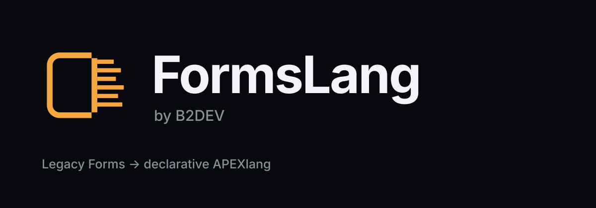
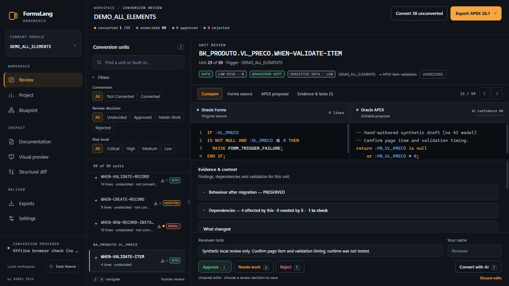
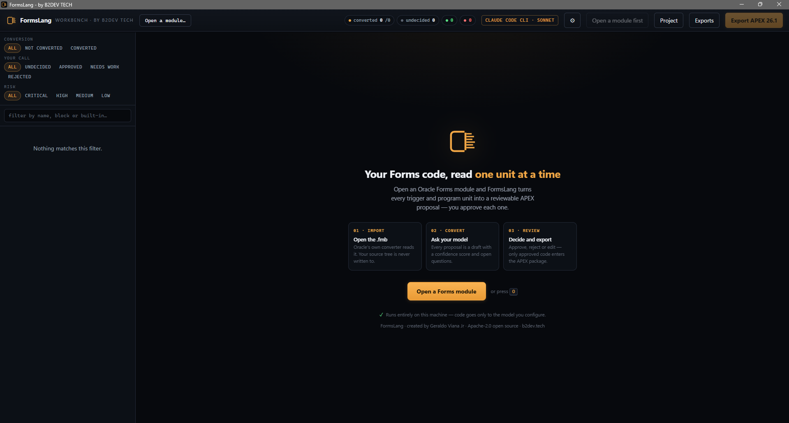
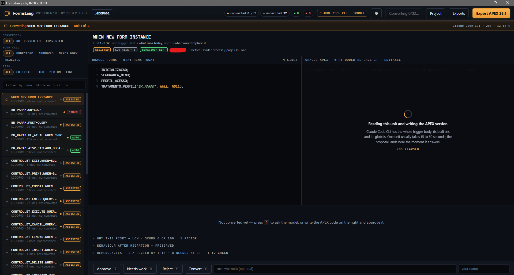
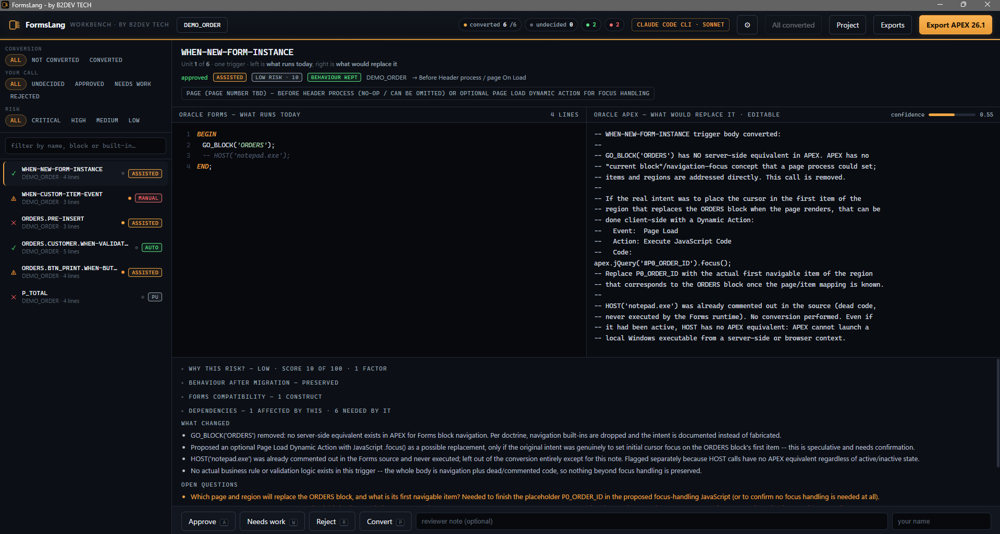
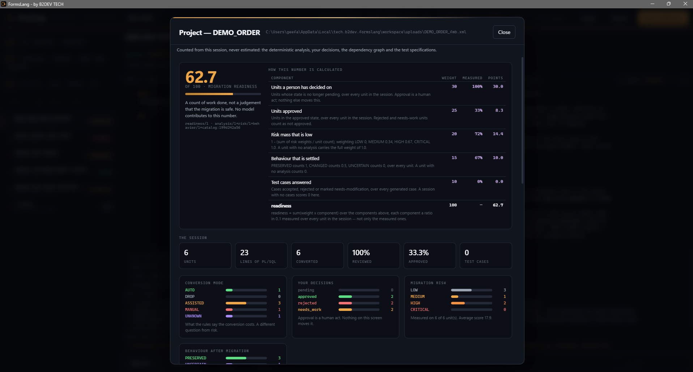
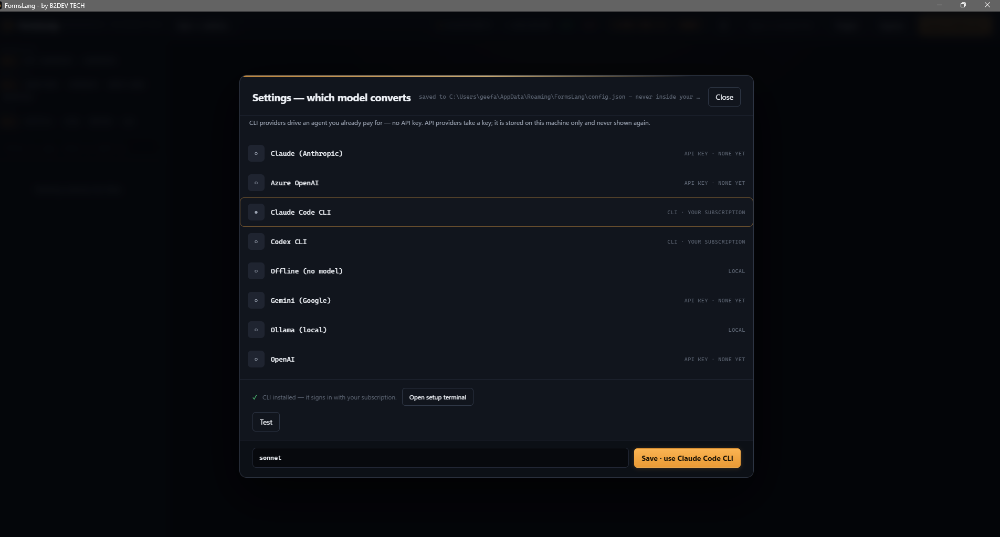
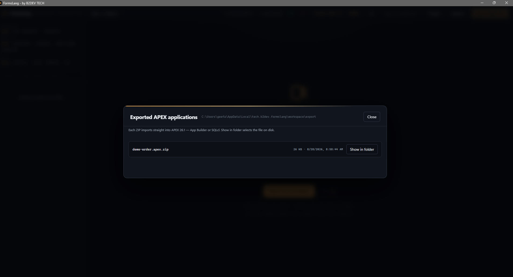

<p align="center">
  
</p>

<p align="center">
  <a href="LICENSE"></a>
  
  
  <a href="https://github.com/B2DEV-TECH/FormsLang/stargazers"></a>
  
  <a href="CONTRIBUTING.md"></a>
</p>

**FormsLang is an open-source toolkit for analyzing Oracle Forms
applications and assisting modernization and migration initiatives toward
Oracle APEX and modern Oracle architectures.** Apache-2.0 licensed — see
[LICENSE](LICENSE).

FormsLang reads your `.fmb` modules, classifies every trigger and built-in
against a Forms→APEX catalog, and tells you what the migration actually
costs — measured from your own code, not estimated from a spreadsheet. Then
its workbench does the migration with you: one code body at a time, an AI
proposal on every unit, a human decision on every proposal.

> **Status: alpha, in development.** The parser, the assessment workflow, the
> review workbench and the export components are available for technical
> evaluation. Every proposal the workbench produces remains subject to human
> review and functional validation — a draft to approve, never a finished
> migration.

<p align="center">
  
</p>

<p align="center">
  <sub>The workbench mid-review: a block-level <code>PRE-INSERT</code> trigger, the APEX code
  proposed to replace it, what changed and why, and the questions the model refused
  to answer on its own. The verdict on this one was <em>rejected</em> — by a human.</sub>
</p>

## Creator

FormsLang was created by **[Geraldo Viana Jr](https://github.com/gevianajr)**,
Oracle developer and founder of **[B2DEV TECH](https://b2dev.tech)**. The
project is maintained under the [B2DEV-TECH](https://github.com/B2DEV-TECH)
GitHub organization and released as Open Source software for the Oracle
developer community. See [AUTHORS.md](AUTHORS.md).

---

## Why this exists

Every Oracle Forms migration starts with the same question — *how big is
this, really?* — and the same three bad answers: a guess, a per-screen
average, or a vendor's optimistic demo on the simplest form in the system.

FormsLang answers it by counting. It converts each module through Oracle's
own XML toolchain, parses the result, and prices every trigger, built-in and
program unit against a catalog of what happens to it in APEX.

## Repeated code is a first-class concern

While developing the parser, I found that repeated PL/SQL bodies must be
treated as a first-class architectural concern. Oracle Forms applications are
frequently created from templates, which can cause identical triggers and
program units to appear across multiple modules.

FormsLang therefore normalizes and fingerprints code bodies so repeated logic
can be identified and reviewed consistently wherever it appears. That is also
why deduplication exists in the scoring: counting every copy at full price
inflates any estimate built on the count, so a body solved once is charged
once and the correction is shown rather than hidden.

## What makes the numbers defensible

**1. Effort is reported in points, not hours.**
A point is derived from what was counted in the XML. Converting points to
hours needs a calibration factor that can only come from real conversions you
have measured. The report labels that factor an assumption, every time.

**2. Unknown is never treated as easy.**
Anything outside the catalog is weighted as expensive and named in the report
as *catalog debt*. The catalog grows against reality, not imagination.

**3. Copy-paste is charged once.**
Legacy Forms systems are built by cloning a template. FormsLang fingerprints
every code body; blocks that appear in more than one module are solved once
at portfolio level and only reviewed in the copies. Both totals are shown —
raw and deduplicated — so the correction is visible, not hidden.

**4. Nothing leaves your machine unless you send it.**
The analysis runs locally against a local Oracle Forms install. The HTML
report is a single self-contained file: no CDN, no remote fonts, no
telemetry. The review UI is served on the loopback interface only. AI conversion
requests are sent only to the provider explicitly selected by the user.
Ollama can keep the entire conversion local. Claude Code CLI, Codex CLI,
and hosted API providers may transmit the selected source code under their
respective account, retention, and data-processing policies.

**5. A number on screen is never a model's opinion.**
Risk, behaviour, dependencies and the readiness score are computed by rules
in this repository, from the source text. The model may be asked to explain
a finding the rules already made; it is never asked what the risk is. Every
weight and threshold is written down in
[docs/risk-model.md](docs/risk-model.md), and the readiness formula is
printed on screen next to its own number.

## The verdict taxonomy

Every trigger and built-in gets one of five verdicts. The difference between
them is economic, not technical.

| Verdict | Meaning |
|---|---|
| `AUTO` | Direct, deterministic APEX equivalent. The machine converts; a human reviews. |
| `ASSISTED` | The intent translates, the form does not. AI proposal, human approval per hunk. |
| `MANUAL` | No APEX equivalent. Needs redesign, an architecture decision, or an integration. |
| `DROP` | Solves a problem APEX does not have. It disappears — and that is a gain. |
| `UNKNOWN` | Catalog debt. Weighted expensive, named in the report, never silently cheap. |

## Two ways to run it

### The desktop app (Windows)

FormsLang ships as a desktop application: a native window around the same
engine, compiled into a single self-contained executable and installed like
any other program (MSI or setup `.exe`). Launch it and the workbench is
simply there — no Python, no terminal, no configuration.

The window is only a view. Underneath, the engine listens on a loopback port
chosen at launch, and everything — sessions, proposals, decisions, exports —
stays on your machine, exactly as in the CLI.

The installer bundles FormsLang and nothing else. Opening `.fmb` files has
the same requirement it has everywhere: your own licensed Oracle Forms
installation on the machine — see
[Oracle Forms toolchain](#oracle-forms-toolchain). Without one, the app
works on already-converted Forms2XML `.xml` files.

Build the installers from source:

```bash
pip install pyinstaller
python -m PyInstaller --noconfirm --onefile --console \
  --name formslang-engine --collect-data formslang --paths . \
  --distpath packaging/dist --workpath packaging/build \
  --specpath packaging packaging/sidecar_entry.py

cp packaging/dist/formslang-engine.exe \
   desktop/src-tauri/binaries/formslang-engine-x86_64-pc-windows-msvc.exe
cd desktop && npm install && npm run tauri build
```

PyInstaller and Tauri are build-time tools only; what ships still has zero
runtime dependencies.

### The CLI

```bash
git clone https://github.com/B2DEV-TECH/FormsLang.git
cd FormsLang
pip install -e .
```

FormsLang has **zero third-party dependencies** — standard library only, all
of it: `urllib` for the AI calls, `sqlite3` for the session, `http.server`
for the review UI. It runs on a locked-down machine where installing a
package is a change request.

### Oracle Forms toolchain

> ⚠️ **Converting `.fmb` files requires a valid Oracle license — yours, not
> ours.** The `.fmb` → XML step runs Oracle's own `Forms2XML` tool, which
> is part of the Oracle Forms product. FormsLang ships **no Oracle
> software** — no jars, no binaries, no derived code — and downloads none.
> It only locates and invokes an Oracle Forms installation that **you**
> have licensed from Oracle and installed yourself, and complying with the
> terms of that Oracle license is entirely your responsibility. No Oracle
> install, no license? Use the XML path below — it involves no Oracle
> software at all.

FormsLang looks for the toolchain in this order:
explicit `--oracle-home` → the `ORACLE_HOME` environment variable → common
install paths. It validates `java.exe` plus `frmxmltools.jar`,
`frmjdapi.jar` and `xmlparserv2.jar`, and names the exact missing file when
something is wrong.

**No Oracle install?** Feed FormsLang the XML directly. If someone else has
already run `frmf2xml`, point the CLI at the `.xml` files and Oracle is out
of the pipeline entirely.

## Use

```bash
# Assess a whole portfolio: convert, analyze, write the report
formslang assess "D:\legacy\forms" -o out -j 8 --title "Forms portfolio"

# One module, in the terminal
formslang inspect "D:\legacy\forms\ORDERS.fmb"

# What the catalog currently covers
formslang catalog
```

`assess` writes two files into `-o`:

- `assessment.html` — the report you send to a decision maker
- `assessment.json` — the same data, for your own tooling

Useful flags: `--limit N` (dry run on a sample), `--no-recursive`,
`--overwrite` (reconvert cached XML), `--hours-per-point` (your own measured
calibration), `--oracle-home`.

**Your source tree is never written to.** Oracle's `Forms2XML` emits the XML
next to the `.fmb`, so FormsLang copies each module into a temporary
directory, converts it there, and moves only the result into your output
folder.

## The workbench

Assessment tells you the size of the job. The workbench does the job — one
code body at a time, with a human deciding on every one.

```bash
# Which provider is configured, and does it answer?
formslang ai --check

# Headless: draft a proposal for every code body in a module
formslang convert "D:\legacy\forms\ORDERS.fmb" -o out

# Review them in the browser (creates the session if there isn't one)
formslang workbench out\ORDERS.session.db

# Or start at a folder and select the exact .fmb in the browser
formslang workbench "D:\legacy\forms" -o out
```

The workbench opens a review screen on `127.0.0.1:8765` (the desktop app
picks its own port). **Open a module…** at the top left selects the `.fmb`
(or an already converted Forms2XML `.xml`) you want to work on. Each module
gets its own resumable session under the FormsLang output directory; no
session or generated artifact is written beside your source.

<p align="center">
  
</p>

The screen shows the original Forms code on the left — syntax-highlighted,
with its verdict, confidence, the open questions the model raised and the
built-ins it had to deal with — and the proposed APEX code on the right,
editable. Approve, reject, or send back for work. That screen is the one in
the screenshot at the top of this page. Everything has a key:

| Key | Action |
|---|---|
| `j` / `k` | next / previous unit |
| `p` | propose a conversion for the current unit |
| `a` / `r` / `w` | approve / reject / send back for work |
| `o` | open a Forms module |
| `d` | the project view |
| `/` | search |

Every decision, with its reviewer and comment, is written to the session
file as it happens. **Propose all** drafts the whole module in one pass;
review remains one unit at a time.

<p align="center">
  
</p>

<p align="center">
  <sub>A CLI provider takes 15 to 60 seconds per unit — the screen accounts for
  every second of it instead of going quiet.</sub>
</p>

### What the screen tells you before you decide

Every unit is measured the moment the module opens — offline, with no
provider configured and nothing sent anywhere. Beside the code comparison,
in expandable sections that stay shut until you want them:

- **Migration risk** — LOW / MEDIUM / HIGH / CRITICAL, with every point of
  the score traced back to a construct actually found in the body. A
  different question from the conversion mode (*what does it cost?*) and a
  different one again from AI confidence (*how sure is the model about this
  draft?*).
- **Behaviour after migration** — PRESERVED / CHANGED / UNCERTAIN. Absence
  of evidence is never PRESERVED, and the model may make this answer more
  conservative, never less.
- **Dependencies** — what this unit uses and what uses it, direct and
  transitive, so *what else breaks if I change this?* has an answer before
  the change is made.
- **Forms compatibility findings** — every built-in found, its migration
  class, and what APEX offers instead.
- **Test cases** — written from the original Forms body, not from the
  generated APEX, and marked as inherited Forms behaviour, modernization, or
  something that needs confirmation. Accept, reject or send back each one.
  FormsLang writes these specifications; it does not run them, and the
  screen says so.

<p align="center">
  
</p>

<p align="center">
  <sub>The risk score is traced back to the exact constructs it counted —
  here, a <code>HOST()</code> call that was already commented out in the source
  contributes nothing, because it never runs.</sub>
</p>

### The project view (`d`)

Totals, conversion modes, decisions, risk and behaviour distributions, what
is in the way, the highest-risk units, the Forms features APEX has no
equivalent for, and where the dependencies pile up — counted from the
session, never estimated.

<p align="center">
  
</p>

It carries one readiness score, and prints the exact arithmetic that
produced it right beside the number: five weighted components, each a ratio
over *every* unit in the session, so a unit nobody analysed lowers the score
instead of quietly leaving the denominator. Blockers are deliberately kept
out of the score — a blocker is work to do, not a percentage. The full model
is in [docs/risk-model.md](docs/risk-model.md).

## AI-assisted conversion

### Providers

Everything is configured in the app: the gear in the workbench header (or
the provider chip) opens Settings, where every provider shows what it needs
and whether this machine has it — a missing API key or an uninstalled CLI
is a label, not a surprise at request time. Pick a provider, paste a key or
open the setup terminal for a CLI, press **Test**, save.

<p align="center">
  
</p>

| Provider | Kind | What it needs |
|---|---|---|
| Claude Code CLI · Codex CLI | your installed CLI | nothing — rides the subscription you already authenticated (an **Open setup terminal** button handles first sign-in) |
| Anthropic · OpenAI · Azure OpenAI · Google | HTTP API | an API key, pasted once in Settings |
| Ollama | local HTTP | a local model; code never leaves the machine |
| Offline (`echo`) | stub | nothing; the default |

**Privacy notice:** AI proposals may include the selected Oracle Forms
source code. Before using a hosted API or CLI provider, confirm that you
are authorized to process the source through that service and review the
provider's training, retention, and data-processing policies. Use Ollama or
manual conversion when the source cannot leave the local environment.

Settings are written to `%APPDATA%\FormsLang\config.json` on Windows
(`~/.config/formslang/config.json` elsewhere) — never inside your project.
The API key is **write-only through the UI**: it travels browser → server
when you save or test it, and never appears in a browser response, a log, or
an error message. It is **not** written to that configuration file — it goes
to the operating system's credential store: Windows Credential Manager, the
macOS Keychain, or the Secret Service (libsecret) on Linux. Where the
platform offers no such store, FormsLang **refuses to save the key** rather
than falling back to plaintext, and asks you to set `FORMSLANG_AI_KEY`
instead. For sensitive environments, environment variables and CLI providers
remain the recommended route. Saving an empty key forgets the stored one.
Full rules in [docs/SPEC.md](docs/SPEC.md).

Environment variables remain the power-user and CI route, and they **always
win** over the settings file:

| Variable | Meaning |
|---|---|
| `FORMSLANG_AI_PROVIDER` | `claude_cli`, `codex_cli`, `anthropic`, `openai`, `azure_openai`, `google`, `ollama`, or `echo` |
| `FORMSLANG_AI_MODEL` | model name; each provider has a sane default |
| `FORMSLANG_AI_KEY` | API key — overrides any stored one; never logged, never sent to the browser |
| `FORMSLANG_AI_BASE_URL` | override the endpoint (self-hosted, gateway, proxy) |
| `FORMSLANG_AI_DEPLOYMENT` · `FORMSLANG_AI_API_VERSION` | Azure OpenAI only |
| `FORMSLANG_CONFIG_DIR` | override where `config.json` lives |

The default is `echo`: an offline stub that answers with a well-formed
proposal of confidence `0.00` saying plainly that no model ran. Nothing is
sent anywhere until you choose a provider on purpose — the workbench asks
once with a banner, it never assumes. For portfolios that may not leave the
building, `ollama` keeps the code on the machine. And a provider is never
required: the right pane is an editor, so you can write the APEX
replacement yourself and approve it.

### What the model is told

The system prompt is a doctrine, not a hint. It carries the Forms→APEX
mapping rules, and three honesty rules that matter more than the mapping:
never invent an APEX API; never silently drop code you cannot convert; when
the source is ambiguous, say so in `open_questions` and cap the confidence.
A low-confidence proposal is doing its job — it is the one that most needs a
human.

### Copy-paste is converted once here too

Deduplication is not just a line in the report. Within a run, the first
proposal for a given fingerprint is reused for every identical body, and each
reuse is labelled as such in the notes so a reviewer is never shown recycled
work as if it were fresh. Failed answers are never cached.

## Exporting for APEX 26.1

Choose **Export APEX 26.1**, then set the application name, alias, application
ID and page number. Workspace and parsing schema are optional so a package can
be generated and validated before a target database is available. The export
folder contains:

- `<alias>.apex.zip` — the APEXlang 26.1 package for SQLcl validation/import
- `<alias>/` — the same application as an expanded, reviewable APEXlang tree
- `<alias>-review/` — `approved.sql`, `session.json` and the mapping manifest

The **Exports** button in the workbench header lists every ZIP built so
far, newest first, each with a *Show in folder* action that selects the
file in your file manager; the same panel opens after every export.

<p align="center">
  
</p>

The ZIP is deliberately separate from the audit artifacts. Only approved
proposals are included, and they are emitted as disabled page-process
candidates until their execution point and condition are confirmed in Page
Designer. Regions and page items are a migration scaffold; schema binding,
LOVs, validations and application navigation still require functional review.

Validation is offline and needs SQLcl 26.1, but no database connection:

```text
apex validate -input my-app.apex.zip
```

Import is the step that needs an Oracle database connection and an APEX 26.1
workspace/schema:

```text
sql user/password@service
apex import -input my-app.apex.zip
```

## Architecture

```
formslang/
├── oracle.py    # the ONLY module that touches Oracle binaries
├── parser.py    # Forms2XML output -> domain model
├── model.py     # what a Forms module is, minus the layout noise
├── rules.py     # the catalog: Forms -> APEX. The core asset.
├── plsql.py     # lexical analysis + code fingerprinting
├── risk.py      # migration risk: LOW / MEDIUM / HIGH / CRITICAL, with evidence
├── behavior.py  # does it still do the same thing? PRESERVED / CHANGED / UNCERTAIN
├── analysis.py  # one deterministic pass per unit: compat + risk + behaviour
├── depgraph.py  # what else breaks if I change this unit
├── testspec.py  # test cases written from the Forms body, not from the output
├── dashboard.py # the project view, and the readiness score's arithmetic
├── assess.py    # scoring, tiers, portfolio deduplication
├── report.py    # self-contained HTML + JSON
├── ai.py        # provider layer (urllib only) + CLI providers + offline stub
├── config.py    # the settings file the in-app Settings screen writes
├── convert.py   # conversion tasks, the doctrine prompt, answer parsing
├── store.py     # SQLite session: proposals, decisions, audit trail
├── apexlang.py  # APEXlang 26.1 project and import ZIP generation
├── ui.py        # the review screen, one self-contained HTML string
├── workbench.py # loopback HTTP server behind the review screen
└── cli.py       # assess / inspect / catalog / convert / workbench / ai

desktop/         # Tauri 2 shell: native window, engine sidecar, MSI/NSIS
packaging/       # PyInstaller entry: freezes the engine into one .exe
assets/brand/    # the FormsLang brand kit (SVG)
```

Two parser details that break naive readers, both handled:

1. **Double-escaped newlines.** Forms2XML stores code in an XML *attribute*,
   escaping newlines as the literal string `&#10;`. After the normal XML
   unescape the text still contains those seven characters. Without a second
   decoding pass, every trigger collapses to a single line.
2. **Accent mojibake.** The `.fmb` stores cp1252; Forms2XML declares UTF-8
   but emits the original bytes, so `Conexão` arrives as `Conexão`. The
   repair is applied only when it produces valid text.

## Tests

```bash
pytest
```

The suite covers the parser, the catalog, the scoring, the session store,
the APEX export and the workbench's DOM contract — including that the review
screen stays fully self-contained: zero external URLs, zero CDN, zero remote
fonts. The fixtures are synthetic: they reproduce the structure and edge cases
Forms2XML produces — namespace, attribute-held code, double-escaped newlines,
encoding problems — and the repository carries no third-party Forms modules,
proprietary business rules, credentials or production data.

## Roadmap

- [x] Oracle toolchain bridge and XML parser
- [x] Forms→APEX classification catalog
- [x] Portfolio assessment with copy-paste deduplication
- [x] Self-contained HTML / JSON report
- [x] AI-assisted conversion workbench (proposal + approval per hunk)
- [x] APEXlang 26.1 project and import ZIP generation
- [x] Windows desktop app (bundled engine, MSI / NSIS installers)
- [ ] Semantic diff and merge across module versions

## Community

Contributions, bug reports and ideas are welcome:

- **[CONTRIBUTING.md](CONTRIBUTING.md)** — how to fork, branch, test and
  open a pull request.
- **[CODE_OF_CONDUCT.md](CODE_OF_CONDUCT.md)** — Contributor Covenant 2.1.
- **[SECURITY.md](SECURITY.md)** — report vulnerabilities privately, never
  in a public issue.
- **[CHANGELOG.md](CHANGELOG.md)** — what changed, release by release.

If FormsLang helped you size or run a Forms migration, a GitHub star helps
other Oracle developers find it.

## Project status

FormsLang is under **active development**. The engine, the CLI flags, the
HTTP API of the local workbench and the export formats may still evolve
between releases; nothing here is promised stable yet. The changelog
records every visible change, and [releases](https://github.com/B2DEV-TECH/FormsLang/releases)
carry the installers.

## Legal

FormsLang is **Open Source** software, copyright © 2026 Geraldo Viana Jr,
licensed under the [Apache License 2.0](LICENSE). You may use, modify and
redistribute it, including commercially, under the terms of that license;
the [NOTICE](NOTICE) file travels with every copy. The code you migrate
with it — and every APEX artifact it generates from your code — is yours.

**Oracle licensing.** FormsLang contains and redistributes no Oracle
software. Converting `.fmb` files invokes Oracle's `Forms2XML` from an
Oracle Forms installation that you must have licensed from Oracle yourself;
using FormsLang neither grants, replaces nor extends any Oracle license.
Working from pre-converted XML requires no Oracle software at all.

Oracle, Java and related trademarks are registered trademarks of Oracle
and/or its affiliates. FormsLang is an independent Open Source project and
is not affiliated with or endorsed by Oracle Corporation.
