<p align="center">
  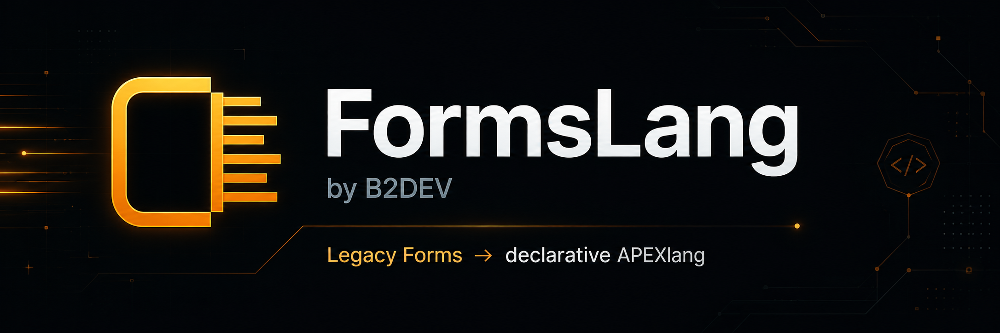
</p>

<p align="center">
  <a href="https://github.com/B2DEV-TECH/FormsLang/releases/latest"></a>
  <a href="https://github.com/B2DEV-TECH/FormsLang/actions/workflows/ci.yml"></a>
  <a href="LICENSE"></a>
  
  
  <a href="https://github.com/B2DEV-TECH/FormsLang/stargazers"></a>
  <a href="CONTRIBUTING.md"></a>
</p>

**FormsLang is an open-source toolkit for analyzing Oracle Forms
applications and modernizing them toward Oracle APEX 26.1.** It assesses a
portfolio, converts one module at a time with a human deciding on every
unit, documents and diffs Forms modules, exports an APEXlang application
that imports into APEX, and hands the whole thing to a pipeline.
Apache-2.0 licensed — see [LICENSE](LICENSE).

FormsLang reads your `.fmb` modules, classifies every trigger and built-in
against a Forms→APEX catalog, and tells you what the migration actually
costs — measured from your own code, not estimated from a spreadsheet. Then
its workbench does the migration with you: one code body at a time, an AI
proposal on every unit, a human decision on every proposal. What comes out
is an APEX 26.1 application that SQLcl validates and imports — and that the
same session rebuilds, byte for byte, on a build server.

> **Status: 1.0, stable.** The CLI, the session file, the export layout and
> the workbench's local HTTP API are promised stable within 1.x — additive
> changes only, every visible change in [CHANGELOG.md](CHANGELOG.md). Every
> proposal the workbench produces is still a draft for a human to approve;
> a migration remains something a person owns.

<p align="center">
  
</p>

<p align="center">
  <sub>The workbench mid-review: unit 4 of 59, a <code>WHEN-VALIDATE-ITEM</code> on
  <code>BK_PRODUTO.VL_PRECO</code>. Left, the four lines that run today; right, the page
  validation proposed to replace them; underneath, <em>what changed</em> — facts first,
  then inferences, then the two assumptions the model made and flagged as unverified.
  The verdict is still open. The bar at the bottom is waiting for a name.</sub>
</p>

## Creator

FormsLang was created by **[Geraldo Viana Jr](https://github.com/gevianajr)**,
Oracle developer and founder of **[B2DEV TECH](https://b2dev.tech)**. The
project is maintained under the [B2DEV-TECH](https://github.com/B2DEV-TECH)
GitHub organization and released as Open Source software for the Oracle
developer community. See [AUTHORS.md](AUTHORS.md).

---

## Contents

- [What you can do with it](#what-you-can-do-with-it)
- [Five minutes, end to end](#five-minutes-end-to-end)
- [Why this exists](#why-this-exists) · [What makes the numbers defensible](#what-makes-the-numbers-defensible) · [The verdict taxonomy](#the-verdict-taxonomy)
- [Two ways to run it](#two-ways-to-run-it) — desktop app, CLI, the Oracle Forms toolchain
- [Assess a portfolio](#assess-a-portfolio)
- [The workbench](#the-workbench) — review, project view, Doc / Diff / Preview
- [Authentication and multi-user workspaces](#authentication-and-multi-user-workspaces)
- [AI-assisted conversion](#ai-assisted-conversion) — providers, privacy, enterprise mode
- [Exporting for APEX 26.1](#exporting-for-apex-261) — the dialog, the CLI twin, validate and import
- [Versioning Forms and APEXlang in git](#versioning-forms-and-apexlang-in-git)
- [CI/CD](#cicd)
- [CLI reference](#cli-reference) · [Environment variables](#environment-variables)
- [Architecture](#architecture) · [Tests](#tests) · [Roadmap](#roadmap)
- [Community](#community) · [Project status](#project-status) · [Legal](#legal)

## What you can do with it

| Job | In the workbench | From a terminal or CI |
|---|---|---|
| **Size a migration** — every trigger, built-in and program unit priced against the catalog, copy-paste charged once | the project view | `formslang assess <folder> -o out` |
| **Convert a module** — AI proposal per unit, or write the APEX replacement yourself; approve, reject, send back, with a name on every decision | the review screen | `formslang convert` (headless drafts) + `formslang workbench` |
| **Document a module** — one self-contained HTML reference: blocks, items, triggers, program units, LOVs, record groups, relations, with the properties Forms actually stored | **Doc** | `formslang doc ORDERS.fmb -o out` |
| **Diff two revisions** — structurally: what moved, property by property and hunk by hunk, everything else reported unchanged because it was | **Diff** | `formslang diff v1.fmb v2.fmb -o out` |
| **See the screens** — every canvas next to the APEX page items its fields become, with the exact mapping the export will use | **Preview** | `formslang preview ORDERS.fmb -o out` |
| **Build the APEX application** — an APEXlang 26.1 project and import ZIP, deterministic, from the approved work only | **Export APEX 26.1** | `formslang export ORDERS.session.db` |
| **Prove it and ship it** — SQLcl `apex validate` / `apex import` against your workspace, password never on a command line | **Exports → Validate / Import** | `formslang apex validate <zip>` · `formslang apex import <zip>` |
| **Version all of it** — the `.fmb`, its Forms2XML text, the review session and the APEXlang tree in git; structural diffs on pull requests; identical bytes on every rebuild | — | [`docs/ci-cd.md`](docs/ci-cd.md) · [`examples/ci/formslang-apex.yml`](examples/ci/formslang-apex.yml) |

Everything on the left calls the same function as the thing on the right.
There is one exporter, one differ, one documenter — reachable from a button
and from a shell, so a pipeline reproduces exactly what a reviewer saw.

## Five minutes, end to end

```bash
pip install -e .                         # or run the Windows installer from Releases

# 1. Open a module, review it, press "Export APEX 26.1" in the header.
formslang workbench "D:\legacy\forms\ORDERS.fmb" -o out

# 2. The dialog showed the command line that rebuilds the same ZIP:
formslang export out\ORDERS.session.db          # choices remembered on the session

# 3. Prove it compiles against your workspace, then import it.
formslang apex validate out\export\orders.apex.zip   # asks for the password, hidden
formslang apex import   out\export\orders.apex.zip
```

No Oracle Forms on this machine? Start from a Forms2XML `.xml` instead of
the `.fmb` — every command accepts either. No SQLcl on the path? Point at
it with `--sqlcl` or `FORMSLANG_SQLCL_PATH`, or set it once in Settings.

## Why this exists

Every Oracle Forms migration starts with the same question — *how big is
this, really?* — and the same three bad answers: a guess, a per-screen
average, or a vendor's optimistic demo on the simplest form in the system.

FormsLang answers it by counting. It converts each module through Oracle's
own XML toolchain, parses the result, and prices every trigger, built-in and
program unit against a catalog of what happens to it in APEX.

## Repeated code is a first-class concern

While developing the parser, I found that repeated PL/SQL bodies must be
treated as a first-class architectural concern. Oracle Forms applications are
frequently created from templates, which can cause identical triggers and
program units to appear across multiple modules.

FormsLang therefore normalizes and fingerprints code bodies so repeated logic
can be identified and reviewed consistently wherever it appears. That is also
why deduplication exists in the scoring: counting every copy at full price
inflates any estimate built on the count, so a body solved once is charged
once and the correction is shown rather than hidden.

## What makes the numbers defensible

**1. Effort is reported in points, not hours.**
A point is derived from what was counted in the XML. Converting points to
hours needs a calibration factor that can only come from real conversions you
have measured. The report labels that factor an assumption, every time.

**2. Unknown is never treated as easy.**
Anything outside the catalog is weighted as expensive and named in the report
as *catalog debt*. The catalog grows against reality, not imagination.

**3. Copy-paste is charged once.**
Legacy Forms systems are built by cloning a template. FormsLang fingerprints
every code body; blocks that appear in more than one module are solved once
at portfolio level and only reviewed in the copies. Both totals are shown —
raw and deduplicated — so the correction is visible, not hidden.

**4. Nothing leaves your machine unless you send it.**
The analysis runs locally against a local Oracle Forms install. The HTML
report is a single self-contained file: no CDN, no remote fonts, no
telemetry. The review UI is served on the loopback interface only. AI conversion
requests are sent only to the provider explicitly selected by the user.
Ollama can keep the entire conversion local. Claude Code CLI, Codex CLI,
and hosted API providers may transmit the selected source code under their
respective account, retention, and data-processing policies.

**5. A number on screen is never a model's opinion.**
Risk, behaviour, dependencies and the readiness score are computed by rules
in this repository, from the source text. The model may be asked to explain
a finding the rules already made; it is never asked what the risk is. Every
weight and threshold is written down in
[docs/risk-model.md](docs/risk-model.md), and the readiness formula is
printed on screen next to its own number.

**6. What was reviewed is what gets built.**
The same session exports the same bytes, ZIP included. A pipeline rebuilds
the application from the committed session and gets the artifact the
reviewer approved — not a fresh roll of the dice with today's timestamp in
it.

## The verdict taxonomy

Every trigger and built-in gets one of five verdicts. The difference between
them is economic, not technical.

| Verdict | Meaning |
|---|---|
| `AUTO` | Direct, deterministic APEX equivalent. The machine converts; a human reviews. |
| `ASSISTED` | The intent translates, the form does not. AI proposal, human approval per hunk. |
| `MANUAL` | No APEX equivalent. Needs redesign, an architecture decision, or an integration. |
| `DROP` | Solves a problem APEX does not have. It disappears — and that is a gain. |
| `UNKNOWN` | Catalog debt. Weighted expensive, named in the report, never silently cheap. |

## Two ways to run it

### The desktop app (Windows)

FormsLang ships as a desktop application: a native window around the same
engine, compiled into a single self-contained executable and installed like
any other program (MSI or setup `.exe`, on the
[releases page](https://github.com/B2DEV-TECH/FormsLang/releases)). Launch
it and the workbench is simply there — no Python, no terminal, no
configuration.

The window is only a view. Underneath, the engine listens on a loopback port
chosen at launch, and everything — sessions, proposals, decisions, exports —
stays on your machine, exactly as in the CLI.

The installer bundles FormsLang and nothing else. Opening `.fmb` files has
the same requirement it has everywhere: your own licensed Oracle Forms
installation on the machine — see
[Oracle Forms toolchain](#oracle-forms-toolchain). Without one, the app
works on already-converted Forms2XML `.xml` files.

Build the installers from source:

```bash
pip install -e .          # refreshes the version metadata PyInstaller freezes in
pip install pyinstaller
python -m PyInstaller --noconfirm --onefile --console \
  --name formslang-engine --collect-data formslang --paths . \
  --distpath packaging/dist --workpath packaging/build \
  --specpath packaging packaging/sidecar_entry.py

cp packaging/dist/formslang-engine.exe \
   desktop/src-tauri/binaries/formslang-engine-x86_64-pc-windows-msvc.exe
cd desktop && npm install && npm run tauri build
```

PyInstaller and Tauri are build-time tools only; what ships still has zero
runtime dependencies.

### The CLI

```bash
git clone https://github.com/B2DEV-TECH/FormsLang.git
cd FormsLang
pip install -e .
```

FormsLang has **zero third-party dependencies** — standard library only, all
of it: `urllib` for the AI calls, `sqlite3` for the session, `http.server`
for the review UI, `subprocess` for Oracle's tools and SQLcl. It runs on a
locked-down machine where installing a package is a change request, and on
a CI runner with nothing but Python.

### Oracle Forms toolchain

> ⚠️ **Converting `.fmb` files requires a valid Oracle license — yours, not
> ours.** The `.fmb` → XML step runs Oracle's own `Forms2XML` tool, which
> is part of the Oracle Forms product. FormsLang ships **no Oracle
> software** — no jars, no binaries, no derived code — and downloads none.
> It only locates and invokes an Oracle Forms installation that **you**
> have licensed from Oracle and installed yourself, and complying with the
> terms of that Oracle license is entirely your responsibility. No Oracle
> install, no license? Use the XML path below — it involves no Oracle
> software at all.

FormsLang looks for the toolchain in this order: explicit `--oracle-home`
→ the `ORACLE_HOME` environment variable → the common install paths → any
folder under `C:\Oracle` that carries a `jlib` directory, in name order (so
a Forms 14c home such as `C:\Oracle\FR1412` is found with nothing set). It
validates `java.exe` plus `frmxmltools.jar`, `frmjdapi.jar` and
`xmlparserv2.jar`, and names the exact missing file when something is
wrong.

**No Oracle install?** Feed FormsLang the XML directly. If someone else has
already run `frmf2xml`, point the CLI at the `.xml` files and Oracle is out
of the pipeline entirely. This is also how a build server works: commit the
XML beside the `.fmb` and the runner needs no Oracle Forms at all.

## Assess a portfolio

```bash
# Assess a whole portfolio: convert, analyze, write the report
formslang assess "D:\legacy\forms" -o out -j 8 --title "Forms portfolio"

# One module, in the terminal
formslang inspect "D:\legacy\forms\ORDERS.fmb"

# What the catalog currently covers
formslang catalog
```

`assess` writes two files into `-o`:

- `assessment.html` — the report you send to a decision maker
- `assessment.json` — the same data, for your own tooling

Useful flags: `--limit N` (dry run on a sample), `--no-recursive`,
`--overwrite` (reconvert cached XML), `--hours-per-point` (your own measured
calibration), `--oracle-home`.

**Your source tree is never written to.** Oracle's `Forms2XML` emits the XML
next to the `.fmb`, so FormsLang copies each module into a temporary
directory, converts it there, and moves only the result into your output
folder.

## The workbench

Assessment tells you the size of the job. The workbench does the job — one
code body at a time, with a human deciding on every one.

```bash
# Which provider is configured, and does it answer?
formslang ai --check

# Headless: draft a proposal for every code body in a module
formslang convert "D:\legacy\forms\ORDERS.fmb" -o out

# Review them in the browser (creates the session if there isn't one)
formslang workbench out\ORDERS.session.db

# Or start at a folder and select the exact .fmb in the browser
formslang workbench "D:\legacy\forms" -o out
```

The workbench opens a review screen on `127.0.0.1:8765` (the desktop app
picks its own port). **Open a module…** at the top left selects the `.fmb`
(or an already converted Forms2XML `.xml`) you want to work on. Each module
gets its own resumable session under the FormsLang output directory; no
session or generated artifact is written beside your source.

<p align="center">
  
</p>

The screen shows the original Forms code on the left — syntax-highlighted,
with its verdict, confidence, the open questions the model raised and the
built-ins it had to deal with — and the proposed APEX code on the right,
editable. Approve, reject, or send back for work. That screen is the one in
the screenshot at the top of this page. Everything has a key:

| Key | Action |
|---|---|
| `j` / `k` | next / previous unit |
| `p` | propose a conversion for the current unit |
| `a` / `r` / `w` | approve / reject / send back for work |
| `o` | open a Forms module |
| `d` | the project view |
| `/` | search |

Every decision, with its reviewer and comment, is written to the session
file as it happens. **Propose all** drafts the whole module in one pass;
review remains one unit at a time.

A CLI provider takes 15 to 60 seconds per unit. While it runs, the top bar
tracks elapsed time, queued units show a spinner, and the unit being read
gets an overlay on the APEX pane — the screen accounts for every second of
it instead of going quiet.

<p align="center">
  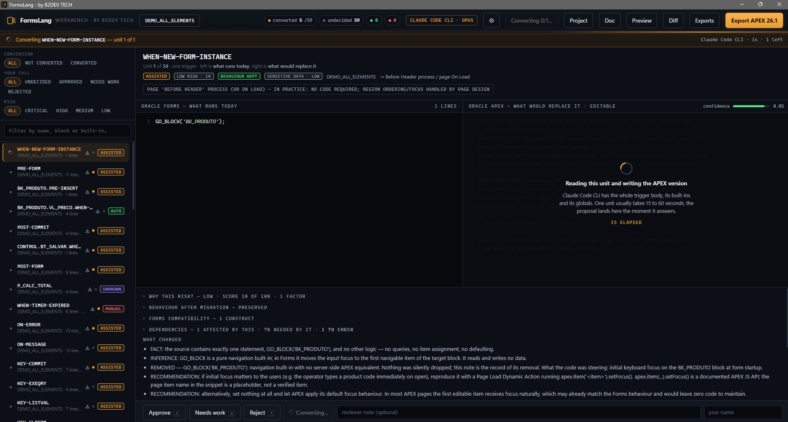
</p>

<p align="center">
  <sub>One unit, one CLI call. The top bar says which unit and how long; the APEX
  pane says what is happening and how long it usually takes; and the panels below —
  risk LOW with its single factor, behaviour PRESERVED, dependencies counted both
  ways — were computed offline, before the model was asked anything.</sub>
</p>

### What the screen tells you before you decide

Every unit is measured the moment the module opens — offline, with no
provider configured and nothing sent anywhere. Beside the code comparison,
in expandable sections that stay shut until you want them:

- **Migration risk** — LOW / MEDIUM / HIGH / CRITICAL, with every point of
  the score traced back to a construct actually found in the body. A
  different question from the conversion mode (*what does it cost?*) and a
  different one again from AI confidence (*how sure is the model about this
  draft?*).
- **Behaviour after migration** — PRESERVED / CHANGED / UNCERTAIN. Absence
  of evidence is never PRESERVED, and the model may make this answer more
  conservative, never less.
- **Dependencies** — what this unit uses and what uses it, direct and
  transitive, so *what else breaks if I change this?* has an answer before
  the change is made.
- **Forms compatibility findings** — every built-in found, its migration
  class, and what APEX offers instead.
- **Sensitive data** — credentials, CPF/CNPJ, contact and card data found
  in the body, each with its line and category and **never** with the
  matched value (see [Sensitive data and enterprise mode](#sensitive-data-and-enterprise-mode)).
- **Test cases** — written from the original Forms body, not from the
  generated APEX, and marked as inherited Forms behaviour, modernization, or
  something that needs confirmation. Accept, reject or send back each one,
  then track execute / pass / fail / blocked per case. FormsLang writes
  these specifications; it does not run them, and the screen says so.

<p align="center">
  
</p>

<p align="center">
  <sub>The risk score is traced back to the exact constructs it counted —
  here, a <code>HOST()</code> call that was already commented out in the source
  contributes nothing, because it never runs.</sub>
</p>

### The project view (`d`)

Totals, conversion modes, decisions, risk and behaviour distributions, what
is in the way, the highest-risk units, the Forms features APEX has no
equivalent for, and where the dependencies pile up — counted from the
session, never estimated.

<p align="center">
  
</p>

It carries one readiness score, and prints the exact arithmetic that
produced it right beside the number: five weighted components, each a ratio
over *every* unit in the session, so a unit nobody analysed lowers the score
instead of quietly leaving the denominator. Blockers are deliberately kept
out of the score — a blocker is work to do, not a percentage. The full model
is in [docs/risk-model.md](docs/risk-model.md).

### Documentation and diffing (`Doc` / `Diff`)

Two buttons in the workbench header — and the same two operations from the
CLI — working off the same parsed module, no separate tool or format.

`Doc` writes a self-contained HTML technical reference for one module: every
block, item, trigger, program unit, LOV, record group and relation, with the
properties Forms actually stored rather than a summary of them. It is the
document a team never had for its own Forms — and, committed next to the
module, the one a pull request can show a change against.

```bash
formslang doc "D:\legacy\forms\ORDERS.fmb" -o out
```

<p align="center">
  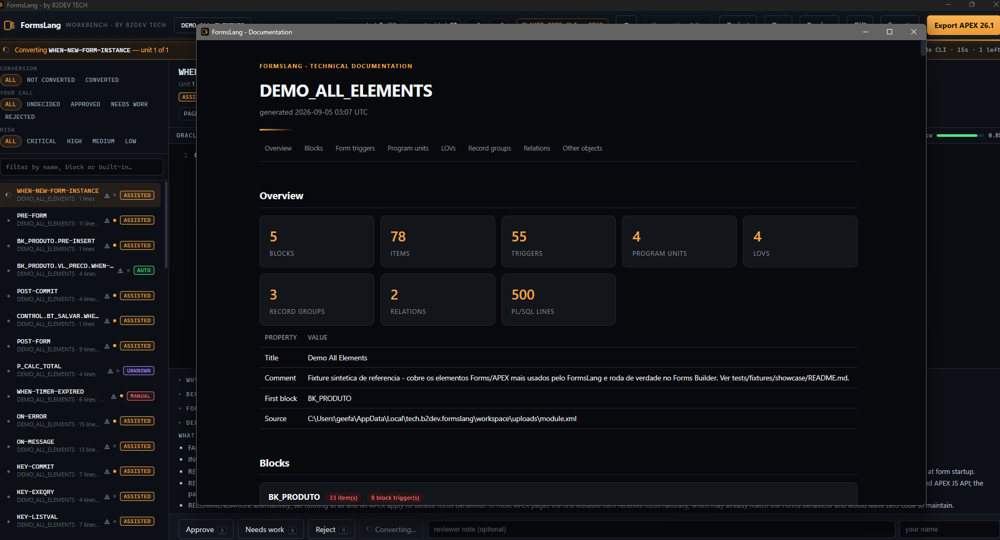
</p>

<table align="center">
  <tr>
    <td width="50%">
      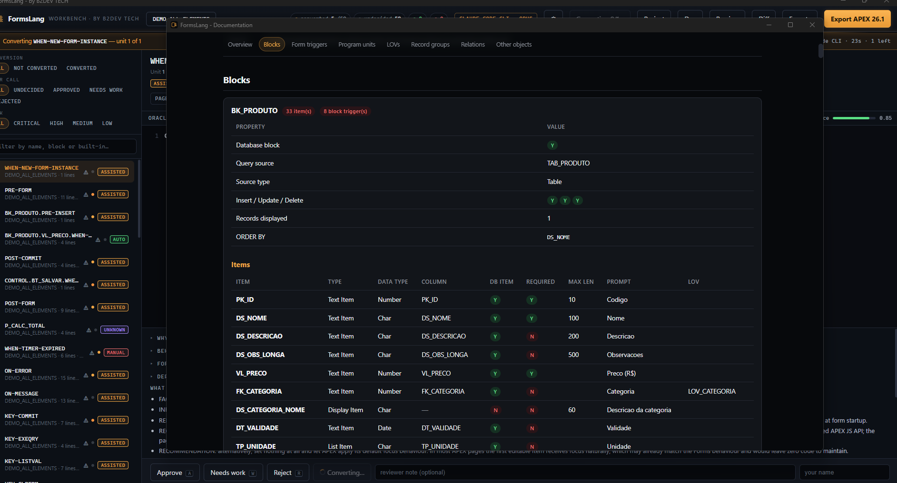
    </td>
    <td width="50%">
      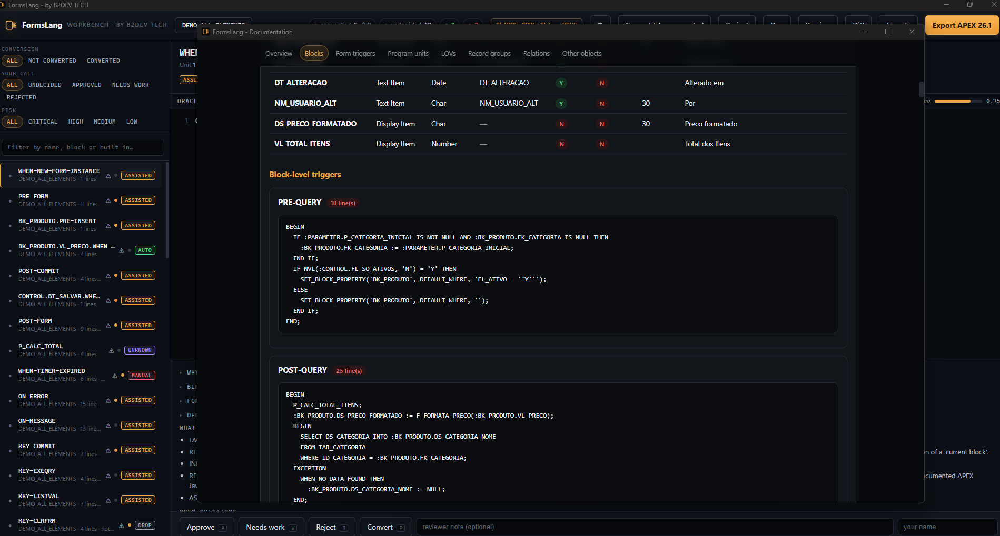
    </td>
  </tr>
</table>

<p align="center">
  <sub>Left: one block, property by property, then every item with its type, column,
  required flag, maximum length, prompt and LOV. Right: the block's triggers,
  verbatim — the <code>PRE-QUERY</code> that sets a default WHERE from a control
  checkbox, the <code>POST-QUERY</code> that formats a price and looks up a category.
  Nothing is summarized. The document <em>is</em> the module.</sub>
</p>

`Diff` structurally compares two versions of the same module — blocks,
items, triggers, program units, LOVs, record groups and relations, property
changes and code hunks alike — and reports only what actually moved.

```bash
formslang diff "D:\legacy\forms\ORDERS_v1.fmb" "D:\legacy\forms\ORDERS_v2.fmb" -o out
```

Run on two real revisions of the same production module, saved about
eighteen hours apart: one block modified — a new button added, a new
`KEY-NEXT-ITEM` trigger, one item's validation changed — every other block,
every form-level trigger and all eighteen program units reported unchanged,
because they were. A `.fmb` in git is a binary blob; this is the diff git
cannot give you.

<table align="center">
  <tr>
    <td width="50%">
      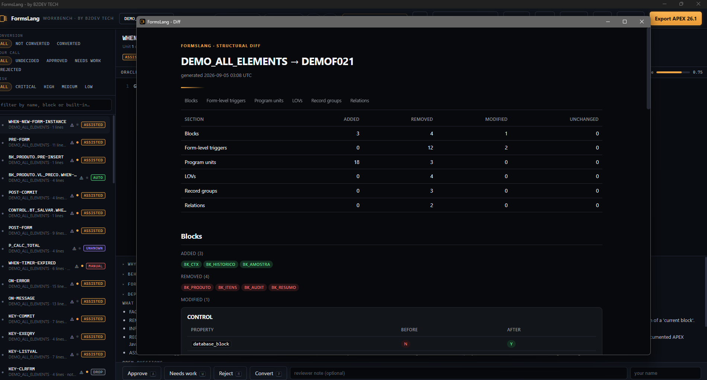
    </td>
    <td width="50%">
      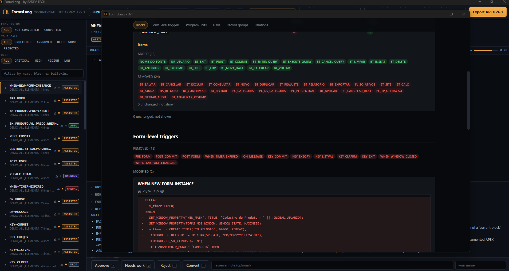
    </td>
  </tr>
</table>

<p align="center">
  <sub>The screenshots are a different run — the showcase module diffed against an
  unrelated one, so every section has something to report. The summary counts
  what was added, removed and modified <em>and</em> what stayed the same; below
  it, blocks, items and triggers as chips, one property per row, and every
  modified code body as a unified hunk. On two revisions of the same module,
  most of this page reads <em>unchanged</em>.</sub>
</p>

### Visual preview (`Preview`)

A third button, same idea: a read-only, side-by-side look at every Forms
canvas next to the APEX page items each of their fields will become, using
the exact mapping `formslang export` would produce — never a hypothetical
one. There is no picker here to choose a different APEX item type; that
choice happens in APEX Builder after export, not before it. Items whose
Forms type isn't one FormsLang has confirmed evidence for are flagged as
approximated rather than silently shown as a sure match.

```bash
formslang preview "D:\legacy\forms\ORDERS.fmb" -o out
```

<p align="center">
  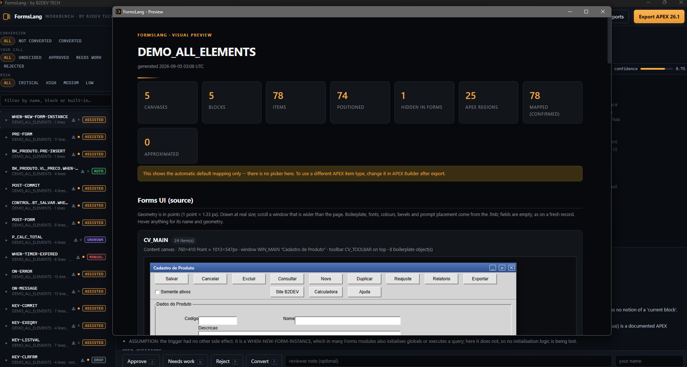
</p>

<table align="center">
  <tr>
    <td width="50%">
      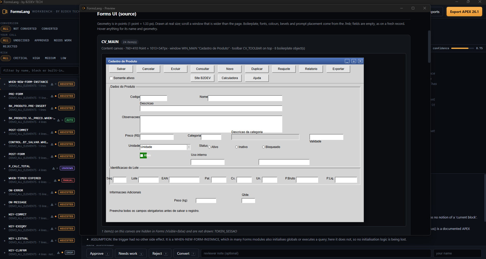
    </td>
    <td width="50%">
      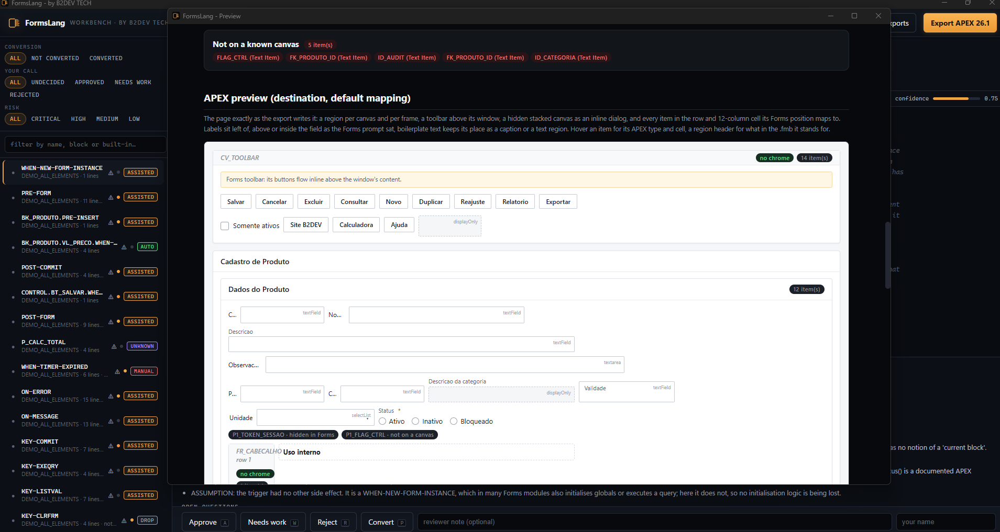
    </td>
  </tr>
</table>

<p align="center">
  <sub>Source on the left, destination on the right — the same 24 items of
  <code>CV_MAIN</code>. The Forms side is drawn from the <code>.fmb</code> geometry
  (1 point = 1.33 px), bevels, prompts and boilerplate included. The APEX side is
  the page exactly as the export writes it, each item badged with the APEX type it
  gets. The five items that live on no canvas are listed, not lost. The counters
  at the top say how much of that mapping rests on confirmed evidence: here, all
  78 items, none approximated.</sub>
</p>

## Authentication and multi-user workspaces

By default the workbench is single-user with no login screen — exactly as
before this feature existed. Set `FORMSLANG_AUTH=1` (read once, at process
start) to turn on organization-scoped identity instead: email/password
login, four roles (Owner, Admin, Developer, Viewer) and mandatory TOTP MFA
for Owner and Admin accounts.

```bash
# PowerShell; use `export` on macOS/Linux
$env:FORMSLANG_AUTH = "1"
formslang workbench "D:\legacy\forms" -o out
```

The same switch is also a persistent choice in the Settings screen, so a
reviewer can turn multi-user mode on from the desktop app and have it
survive a restart without ever touching an environment variable — the
variable, when set, always wins over that saved choice. The same screen
shows whether a first Owner exists yet and opens a terminal on the exact
command that creates one.

With no Owner yet, the login screen has no self-registration on purpose:
the first Owner is created from the host machine, never over HTTP.

```bash
formslang auth bootstrap-owner owner@example.com
# --org-slug / --org-name default to "local" / "Local"
```

The command prompts for the password twice (hidden input via `getpass`) and
never accepts it as a `--password` flag — a flag would land in shell
history and process listings, the same class of leak as a password written
to a log line.

| Role | Can |
|---|---|
| `OWNER` | Everything, including managing other members and their roles. Exactly one is created by `bootstrap-owner`; an organization can have more. |
| `ADMIN` | Manage Developer/Viewer members; cannot touch Owners or other Admins. |
| `DEVELOPER` | Convert and review — the working role for most reviewers. |
| `VIEWER` | Read-only. |

Owner and Admin accounts must enroll an authenticator app (TOTP — Google
Authenticator, Microsoft Authenticator, 1Password or similar) the first
time they log in; that session can reach nothing but the enrollment screen
until it's done. Developer and Viewer accounts may enroll voluntarily.
Once any account has confirmed MFA, every later login asks it for a fresh
code. Lost the device? `formslang auth reset-owner owner@example.com
--clear-mfa` is the same host-CLI-only, never-HTTP break-glass path.

Identity lives in its own `auth.db` (`%APPDATA%\FormsLang\auth.db` on
Windows, next to `config.json`), separate from each module's
`.session.db`, and is never bundled into an export. Design reference:
[docs/auth-multitenancy-design.md](docs/auth-multitenancy-design.md).

## AI-assisted conversion

### Providers

Everything is configured in the app: the gear in the workbench header (or
the provider chip) opens Settings, where every provider shows what it needs
and whether this machine has it — a missing API key or an uninstalled CLI
is a label, not a surprise at request time. Pick a provider, paste a key or
open the setup terminal for a CLI, press **Test**, save.

<p align="center">
  
</p>

| Provider | Kind | What it needs |
|---|---|---|
| Claude Code CLI · Codex CLI | your installed CLI | nothing — rides the subscription you already authenticated (an **Open setup terminal** button handles first sign-in) |
| Anthropic · OpenAI · Azure OpenAI · Google | HTTP API | an API key, pasted once in Settings |
| Ollama | local HTTP | a local model; code never leaves the machine |
| Offline (`echo`) | stub | nothing; the default |

**Privacy notice:** AI proposals may include the selected Oracle Forms
source code. Before using a hosted API or CLI provider, confirm that you
are authorized to process the source through that service and review the
provider's training, retention, and data-processing policies. Use Ollama or
manual conversion when the source cannot leave the local environment.

### Sensitive data and enterprise mode

Every unit is scanned -- deterministically, no AI involved -- for
credentials (`IDENTIFIED BY`, `LOGON(...)`, a password assigned to a
variable, API-key-shaped strings), CPF/CNPJ (checksum-validated), contact
details and financial data (card numbers Luhn-validated). A finding is
shown with its line, category and severity, but **never** with the value
that was matched -- only a redacted excerpt (first and last character,
everything between masked). That rule has no exception: the same redacted
excerpt is what lands in the on-screen finding, in the stored analysis, and
in the compliance report below.

That scan tells you what is in the source. `FORMSLANG_ENTERPRISE_MODE=1`
controls where the source is allowed to go: with it set, any provider whose
traffic would leave the machine is refused outright -- not warned about,
blocked -- at every point that could start a request (Settings, Test, and
starting a conversion run). The check is by the *effective host* the
provider would call, not by provider name: `ollama` pointed at a loopback
or private address is allowed, `claude_cli`/`codex_cli` and every hosted
API provider are not. Echo (no network call at all) and a local Ollama stay
available either way.

Settings are written to `%APPDATA%\FormsLang\config.json` on Windows
(`~/.config/formslang/config.json` elsewhere) — never inside your project.
The API key is **write-only through the UI**: it travels browser → server
when you save or test it, and never appears in a browser response, a log, or
an error message. It is **not** written to that configuration file — it goes
to the operating system's credential store: Windows Credential Manager, the
macOS Keychain, or the Secret Service (libsecret) on Linux. Where the
platform offers no such store, FormsLang **refuses to save the key** rather
than falling back to plaintext, and asks you to set `FORMSLANG_AI_KEY`
instead. For sensitive environments, environment variables and CLI providers
remain the recommended route. Saving an empty key forgets the stored one.
The database password for `apex validate` / `apex import` follows the same
rules, in the same store. Full rules in [docs/SPEC.md](docs/SPEC.md).

Environment variables remain the power-user and CI route, and they **always
win** over the settings file — the complete table is under
[Environment variables](#environment-variables).

The default is `echo`: an offline stub that answers with a well-formed
proposal of confidence `0.00` saying plainly that no model ran. Nothing is
sent anywhere until you choose a provider on purpose — the workbench asks
once with a banner, it never assumes. For portfolios that may not leave the
building, `ollama` keeps the code on the machine. And a provider is never
required: the right pane is an editor, so you can write the APEX
replacement yourself and approve it.

### What the model is told

The system prompt is a doctrine, not a hint. It carries the Forms→APEX
mapping rules, and three honesty rules that matter more than the mapping:
never invent an APEX API; never silently drop code you cannot convert; when
the source is ambiguous, say so in `open_questions` and cap the confidence.
A low-confidence proposal is doing its job — it is the one that most needs a
human.

### Copy-paste is converted once here too

Deduplication is not just a line in the report. Within a run, the first
proposal for a given fingerprint is reused for every identical body, and each
reuse is labelled as such in the notes so a reviewer is never shown recycled
work as if it were fresh. Failed answers are never cached.

## Exporting for APEX 26.1

Choose **Export APEX 26.1**, then set the application name, alias,
application ID and page number. Workspace and parsing schema are optional
so a package can be generated and validated before a target database is
available. The dialog pre-fills the choices of the previous export and,
underneath, shows the exact command line that rebuilds the same ZIP from a
terminal — `formslang export ORDERS.session.db --app-id 19078 --alias
orders` — kept in step with the fields as you type.

<table align="center">
  <tr>
    <td width="50%">
      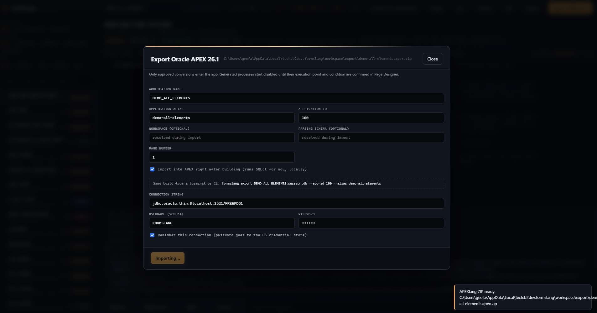
    </td>
    <td width="50%">
      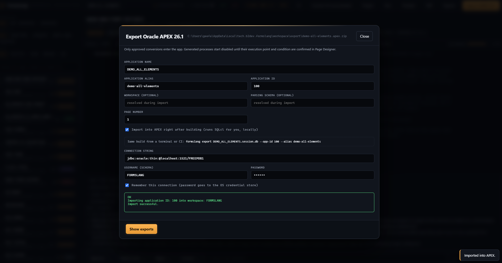
    </td>
  </tr>
</table>

<p align="center">
  <sub>The same dialog, a few seconds apart. Workspace and parsing schema are
  resolved during import, not baked into the ZIP. The line under the checkbox is
  the build a pipeline runs. The password is masked here and goes to the OS
  credential store, never to a file. On the right, SQLcl's own verdict, verbatim.</sub>
</p>

The export folder contains:

- `<alias>.apex.zip` — the APEXlang 26.1 package for SQLcl validation/import
- `<alias>/` — the same application as an expanded, reviewable APEXlang
  tree: `application.apx`, `pages/p00001-….apx`, `shared/…`, the
  manifest. Text, and diffable
- `<alias>-review/` — `approved.sql`, `session.json` and the mapping
  manifest, plus `tests.md` and `compliance.md` when there is anything to
  report (test specs, and sensitive-data findings with whether enterprise
  mode was active and which providers were used)

**The export is deterministic.** Two exports of an unchanged session are
byte-identical, ZIP included: entries are written in name order with a
fixed timestamp, and the application's session-state checksum salt is drawn
once per session (from the OS CSPRNG) and kept in the session file, not
once per export. This is what makes the ZIP a build artifact a pipeline can
rebuild, cache and compare, and the APEXlang tree something you can commit
and diff as two *reviews* rather than two clocks.

The **Exports** button in the workbench header lists every ZIP built so
far, newest first, each with *Show in folder* (selects the file in your
file manager) and an **Import** action that opens the SQLcl dialog —
import, or *validate only, don't change anything*; the same panel opens
after every export.

<p align="center">
  
</p>

The ZIP is deliberately separate from the audit artifacts. Only approved
proposals are included, and they are emitted as disabled page-process
candidates until their execution point and condition are confirmed in Page
Designer. Regions and page items are a migration scaffold — every Forms
item lands on the page's 12-column grid at its canvas position, `MultiLine`
text items become `textarea`, display-only items become `displayOnly`,
Date and Number items deliberately stay `textField` until the richer
keywords have been through a live validate — and schema binding, LOVs,
validations and application navigation still require functional review.

### Validate and import

From the Exports panel, **Validate** and **Import** run your own SQLcl
against the connection saved in Settings (SQLcl path, connect string, user;
the password goes to the OS credential store, never to `config.json`). From
a terminal or a pipeline, the same two operations are:

```bash
formslang apex validate out\export\orders.apex.zip   # compiles the package against the workspace; changes nothing
formslang apex import   out\export\orders.apex.zip   # imports it
```

The target comes from `--connect` / `--user`, from `FORMSLANG_APEX_CONNECT`
/ `FORMSLANG_APEX_USER`, or from Settings. The password comes from
`FORMSLANG_APEX_PASSWORD`, from the connection saved in the workbench, or —
when a person is at the terminal — from a hidden prompt. There is no
`--password`, on purpose. SQLcl is started with `-thin` (no Oracle client
needed) and the password travels on its stdin only.

The exit code is the verdict: `0` done, `1` SQLcl failed — including the
case SQLcl itself reports as success, an `APEXlang Compile Errors` block
with exit 0 and nothing imported — and `2` when the command could not run
(no SQLcl, no target, no password). Under the hood the two commands are
exactly SQLcl's own:

```text
sql -S -thin /nolog
connect user@host:port/service
apex validate -input orders.apex.zip
apex import   -input orders.apex.zip
```

`validate` proves the package compiles; it cannot see a defect that only
appears when a page is rendered. The repeatable procedure for that last
mile — import, make the page public, fetch it through ORDS, read the HTML —
is in [docs/apex-import-verification.md](docs/apex-import-verification.md).

### What lands in APEX

<table align="center">
  <tr>
    <td width="50%">
      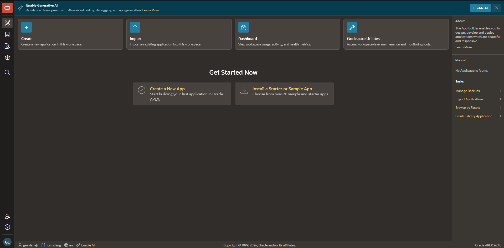
    </td>
    <td width="50%">
      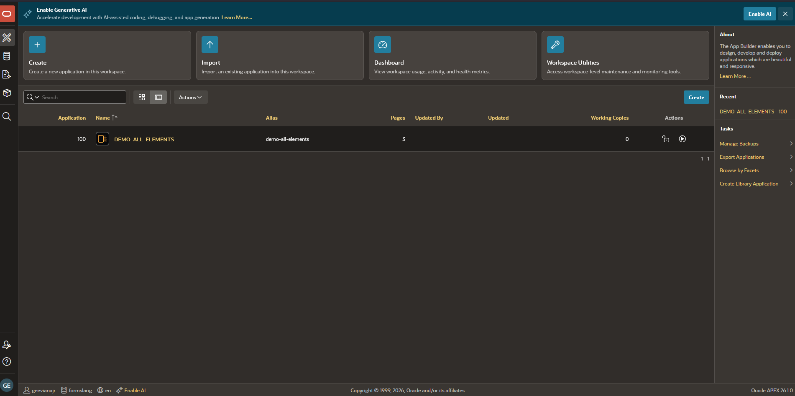
    </td>
  </tr>
</table>

<p align="center">
  <sub>Before and after one <code>formslang apex import</code> on a local APEX 26.1
  (<code>FREEPDB1</code>): an empty workspace, then application 100 with its three
  pages — the ZIP the dialog above built, nothing else.</sub>
</p>

<p align="center">
  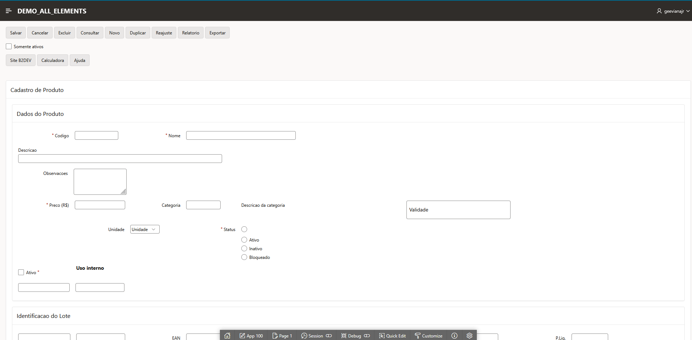
</p>

<p align="center">
  <sub>The converted page, running. Every item of the canvas is on the page, in
  Universal Theme, in the region and grid cell its Forms position mapped to, with
  the required marks Forms declared.</sub>
</p>

> **Note — the layout of the converted application is being improved.** What
> you see above is the scaffold 1.0 exports today: correct placement, correct
> item types, correct required flags, but item widths, label alignment and
> region packing still read as a migration scaffold rather than a finished
> page. Tightening that layout is the current work on the exporter. Schema
> binding, LOVs, validations and navigation remain the functional review
> described above.

## Versioning Forms and APEXlang in git

A Forms module in git has always been a binary blob with a commit message.
FormsLang turns it into something a pull request can show:

| Commit | Why |
|---|---|
| `ORDERS.fmb` | the source Forms Builder edits |
| `ORDERS_fmb.xml` | its Forms2XML text, beside it — every property and every trigger as a line git can diff, and what `formslang diff`, `doc`, `preview` and `export` read on a machine with no Oracle Forms |
| `ORDERS.session.db` | the review: every proposal, every decision with a name on it, the export's choices, the checksum salt |
| `export/orders/` *(optional)* | the APEXlang tree — commit it and each export becomes a diff of the *application*: `pages/p00001-orders.apx` changes exactly where the review changed |

Don't commit the ZIP: it is rebuilt from the session on every run and is
identical when nothing changed. A `.gitattributes` with `*.fmb binary` and
`*.session.db binary` keeps git from trying to merge either.

On a pull request, `formslang diff base/ORDERS_fmb.xml ORDERS_fmb.xml -o
out` produces the structural diff of the form — which block, which item,
which trigger, which property — next to git's line diff of the same file;
the example workflow publishes it as a job artifact. `formslang doc` on the
same revision produces the reference document to go with it.

## CI/CD

1.0 ships the two commands a pipeline needs and the guarantee that makes it
trustworthy:

```
git: ORDERS.fmb + ORDERS_fmb.xml + ORDERS.session.db
        │
        ▼
formslang export ORDERS.session.db        → orders.apex.zip   (same bytes as the reviewer's)
        │
        ▼
formslang apex validate orders.apex.zip   → exit 0 / 1 / 2   (SQLcl, password from the environment)
        │  main only
        ▼
formslang apex import   orders.apex.zip   → the application, in the workspace
```

A runner needs Python, SQLcl (a Java program; Oracle's public
`sqlcl-latest.zip` needs no account) and a route to the database — no
Oracle Forms, no Oracle client. The complete GitHub Actions workflow,
including the pull-request diff job, is
[`examples/ci/formslang-apex.yml`](examples/ci/formslang-apex.yml); the
contract behind it — what to commit, every exit code, how the password
travels, the SQLcl gotchas already paid for — is
[`docs/ci-cd.md`](docs/ci-cd.md). FormsLang's own CI exports the showcase
module twice on every push and fails if the two ZIPs differ.

The next phase builds on exactly this: SQLcl `project`-based promotion
(export the application *back* from APEX so the committed tree round-trips
and `formslang diff` shows what was changed by hand in Page Designer),
DEV → TEST → PROD with the workspace and schema resolved per deployment,
and the render-time check as an optional job. None of it changes the two
commands above.

## CLI reference

Every command that may need to convert an `.fmb` takes `--oracle-home`;
every one accepts a Forms2XML `.xml` in place of the `.fmb`.
`formslang --version` prints the version.

| Command | Does | Flags |
|---|---|---|
| `assess <paths…>` | portfolio report: `assessment.html` + `assessment.json` | `-o`, `-j` jobs, `--limit`, `--no-recursive`, `--overwrite`, `--title`, `--hours-per-point` |
| `inspect <module>` | one module, in the terminal | `-o` |
| `catalog` | what the Forms→APEX catalog covers | |
| `doc <module>` | self-contained HTML technical reference | `-o` |
| `diff <before> <after>` | structural diff between two revisions | `-o` |
| `preview <module>` | every canvas next to the APEX items it maps to | `-o` |
| `convert <module\|session>` | headless AI proposals for every code body | `-o`, `--provider`, `--model`, `--limit` |
| `workbench <module\|session\|folder>` | the review screen on `127.0.0.1:8765` | `-o`, `--port`, `--host` (loopback only), `--no-browser`, `--provider`, `--model` |
| `export <session\|module>` | APEXlang 26.1 project + import ZIP from the approved work; choices remembered on the session | `-o`, `--app-id`, `--name`, `--alias`, `--workspace`, `--schema`, `--page`, `--json` |
| `apex validate <zip>` | SQLcl `apex validate` against a workspace; changes nothing | `--connect`, `--user`, `--sqlcl`, `--timeout`, `--json` |
| `apex import <zip>` | SQLcl `apex import` | same |
| `ai` | which provider is configured; `--check` sends one short request | `--provider`, `--check` |
| `auth bootstrap-owner <email>` | create the first Owner (host CLI only, never HTTP) | `--org-slug`, `--org-name` |
| `auth reset-owner <email>` | last-Owner password recovery | `--clear-mfa` |

Exit codes for `export` and `apex …`: `0` done, `1` SQLcl reported a
failure, `2` the command could not run (and said why on stderr).

## Environment variables

Every variable **wins over the settings file**; none is required.

| Variable | Meaning |
|---|---|
| `FORMSLANG_AI_PROVIDER` | `claude_cli`, `codex_cli`, `anthropic`, `openai`, `azure_openai`, `google`, `ollama`, or `echo` |
| `FORMSLANG_AI_MODEL` | model name; each provider has a sane default |
| `FORMSLANG_AI_KEY` | API key — overrides any stored one; never logged, never sent to the browser |
| `FORMSLANG_AI_BASE_URL` | override the endpoint (self-hosted, gateway, proxy) |
| `FORMSLANG_AI_DEPLOYMENT` · `FORMSLANG_AI_API_VERSION` | Azure OpenAI only |
| `FORMSLANG_APEX_CONNECT` | target for `apex validate` / `apex import`: `host:port/service` |
| `FORMSLANG_APEX_USER` | database user for the same |
| `FORMSLANG_APEX_PASSWORD` | its password — the CI route; goes to SQLcl's stdin only |
| `FORMSLANG_SQLCL_PATH` | the SQLcl binary when it is not `sql` on `PATH` |
| `FORMSLANG_AUTH` | `1` turns on multi-user mode (read once at start; wins over the saved switch) |
| `FORMSLANG_ENTERPRISE_MODE` | `1` refuses any provider whose traffic would leave the machine — see [Sensitive data and enterprise mode](#sensitive-data-and-enterprise-mode) |
| `FORMSLANG_CONFIG_DIR` | override where `config.json` and `auth.db` live |
| `ORACLE_HOME` | the Oracle Forms installation, when autodetection should not decide |

## Architecture

```
formslang/
├── oracle.py       # the ONLY module that touches Oracle binaries (Forms2XML)
├── parser.py       # Forms2XML output -> domain model
├── model.py        # what a Forms module is, minus the layout noise
├── rules.py        # the catalog: Forms -> APEX. The core asset.
├── plsql.py        # lexical analysis + code fingerprinting
├── risk.py         # migration risk: LOW / MEDIUM / HIGH / CRITICAL, with evidence
├── behavior.py     # does it still do the same thing? PRESERVED / CHANGED / UNCERTAIN
├── analysis.py     # one deterministic pass per unit: compat + risk + behaviour
├── depgraph.py     # what else breaks if I change this unit
├── testspec.py     # test cases written from the Forms body, not from the output
├── sensitive.py    # credential / CPF-CNPJ / card scan; the only place a match is formatted, redacted
├── policy.py       # enterprise mode: egress classified by effective host
├── dashboard.py    # the project view, and the readiness score's arithmetic
├── assess.py       # scoring, tiers, portfolio deduplication
├── report.py       # self-contained HTML + JSON
├── formdoc.py      # `doc`: the module's technical reference
├── formdiff.py     # `diff`: structural diff between two revisions
├── formui.py       # `preview`: canvases next to the APEX items they become
├── ai.py           # provider layer (urllib only) + CLI providers + offline stub
├── config.py       # the settings file the in-app Settings screen writes
├── secrets.py      # the OS credential store: Credential Manager / Keychain / libsecret
├── convert.py      # conversion tasks, the doctrine prompt, answer parsing
├── store.py        # SQLite session: proposals, decisions, settings, audit trail
├── apexlayout.py   # Forms canvas geometry -> the APEX 12-column grid
├── apexlang.py     # APEXlang 26.1 project + deterministic import ZIP
├── apeximport.py   # SQLcl driver: validate / import, password on stdin only
├── authstore.py    # organizations, users, roles, sessions, MFA (auth.db)
├── ui/             # the review screen: shell, auth, projects, conversion, review, validation, settings, formdoc, shared
├── workbench.py    # loopback HTTP server behind the review screen
└── cli.py          # every command above; `export` + `apex` are the CI pair

desktop/            # Tauri 2 shell: native window, engine sidecar, MSI/NSIS
packaging/          # PyInstaller entry: freezes the engine into one .exe
examples/ci/        # the GitHub Actions workflow to copy
docs/               # SPEC, risk model, CI/CD contract, import verification, auth design
assets/brand/       # the FormsLang brand kit (SVG)
```

Two parser details that break naive readers, both handled:

1. **Double-escaped newlines.** Forms2XML stores code in an XML *attribute*,
   escaping newlines as the literal string `&#10;`. After the normal XML
   unescape the text still contains those seven characters. Without a second
   decoding pass, every trigger collapses to a single line.
2. **Accent mojibake.** The `.fmb` stores cp1252; Forms2XML declares UTF-8
   but emits the original bytes, so `Conexão` arrives as `Conexão`. The
   repair is applied only when it produces valid text.

And one export detail that breaks APEX rather than the reader: a page item
whose label is hidden must be emitted with `labelColumnSpan: 0`, not with
the default; otherwise the page passes `apex validate` and `apex import`
and fails only when App Builder renders it (`LABEL_COLUMN_SPAN_TOO_BIG`).
That is the class of defect [docs/apex-import-verification.md](docs/apex-import-verification.md)
exists to catch.

## Tests

```bash
pytest
```

The suite covers the parser, the catalog, the scoring, the session store,
the APEX export and its determinism, the CLI (`export` and `apex …` against
a fake SQLcl, including the password paths), the Oracle home detection and
the workbench's DOM contract — including that the review screen stays fully
self-contained: zero external URLs, zero CDN, zero remote fonts. The
fixtures are synthetic: they reproduce the structure and edge cases
Forms2XML produces — namespace, attribute-held code, double-escaped
newlines, encoding problems — and the repository carries no third-party
Forms modules, proprietary business rules, credentials or production data.
`tests/fixtures/showcase/` is a synthetic module that exercises every
element type the exporter maps, with its own README.

CI runs the suite on Linux and Windows across Python 3.10–3.13, runs
`ruff`, and exports the showcase module twice to require identical bytes.

## Roadmap

### Available

- [x] Oracle toolchain bridge and XML parser; Forms homes found under
      `C:\Oracle` with nothing configured
- [x] Forms→APEX classification catalog
- [x] Portfolio assessment with copy-paste deduplication
- [x] Self-contained HTML / JSON report
- [x] AI-assisted conversion workbench (proposal + approval per hunk)
- [x] APEXlang 26.1 project and import ZIP generation, deterministic down
      to the bytes, with items on the page grid at their canvas position
- [x] `formslang export` and `formslang apex validate|import` — the CI
      pair; the export dialog shows the command line that reproduces it
- [x] Proof that a generated export imports on a real Oracle APEX 26.1
      instance, and the repeatable render-time check
      ([`docs/apex-import-verification.md`](docs/apex-import-verification.md))
- [x] Windows desktop app (bundled engine, MSI / NSIS installers)
- [x] Secure multi-user workspaces: RBAC, MFA/TOTP, per-organization
      isolation — switched on from Settings or `FORMSLANG_AUTH`, the first
      Owner created from the host CLI alone, never over HTTP
- [x] Sensitive-data scan on every unit and an enterprise mode that blocks
      cloud egress outright, classified by effective host
- [x] `formdoc` / `formdiff` / `formui`: documentation, structural diff and
      visual preview, from the CLI and from the workbench
- [x] Functional validation workflow: generated test cases with a tracked
      execute / pass / fail / blocked loop
- [x] Continuous integration (GitHub Actions: pytest + ruff, Python
      3.10–3.13, Linux + Windows, deterministic-export check) and the
      example pipeline in [`examples/ci/`](examples/ci/)

### Next phase: continuous delivery with SQLcl

- [ ] SQLcl `project` round-trip: export the application back from APEX
      after a Page Designer session, so the committed APEXlang tree stays
      the source of truth and `formslang diff` shows hand-made changes
- [ ] Environment promotion: one validated ZIP through DEV → TEST → PROD,
      workspace and schema resolved per deployment
- [ ] Render-time verification as an optional CI job against a disposable
      APEX container (the ORDS check, automated)
- [ ] Wider item-type mapping (`datePicker`, `numberField`, select lists
      from LOVs) — each keyword only after a live `apex validate`

### Later

- [ ] Interactive hunk-by-hunk merge engine across module versions (`formdiff`
      reports the structural diff; applying it is still manual)
- [ ] Larger benchmark corpus (100 / 500 modules) with tracked performance
      budgets
- [ ] Broader LOV / validation / navigation / process-flow coverage
- [ ] Installer code signing
- [ ] Team / server mode

## Community

Contributions, bug reports and ideas are welcome:

- **[CONTRIBUTING.md](CONTRIBUTING.md)** — how to fork, branch, test and
  open a pull request.
- **[CODE_OF_CONDUCT.md](CODE_OF_CONDUCT.md)** — Contributor Covenant 2.1.
- **[SECURITY.md](SECURITY.md)** — report vulnerabilities privately, never
  in a public issue.
- **[CHANGELOG.md](CHANGELOG.md)** — what changed, release by release.

If FormsLang helped you size or run a Forms migration, a GitHub star helps
other Oracle developers find it.

## Project status

FormsLang **1.0 is stable**. Within the 1.x line, the CLI commands and
their flags, the `.session.db` file (a 1.0 session opens in every later
1.x), the export layout (`<alias>.apex.zip`, `<alias>/`, `<alias>-review/`)
and the workbench's local HTTP API only gain things; anything that would
break one of them is a 2.0. The changelog records every visible change, and
[releases](https://github.com/B2DEV-TECH/FormsLang/releases) carry the
installers.

## Legal

FormsLang is **Open Source** software, copyright © 2026 Geraldo Viana Jr,
licensed under the [Apache License 2.0](LICENSE). You may use, modify and
redistribute it, including commercially, under the terms of that license;
the [NOTICE](NOTICE) file travels with every copy. The code you migrate
with it — and every APEX artifact it generates from your code — is yours.

**Oracle licensing.** FormsLang contains and redistributes no Oracle
software. Converting `.fmb` files invokes Oracle's `Forms2XML` from an
Oracle Forms installation that you must have licensed from Oracle yourself;
using FormsLang neither grants, replaces nor extends any Oracle license.
Working from pre-converted XML requires no Oracle software at all.

Oracle, Java and related trademarks are registered trademarks of Oracle
and/or its affiliates. FormsLang is an independent Open Source project and
is not affiliated with or endorsed by Oracle Corporation.
