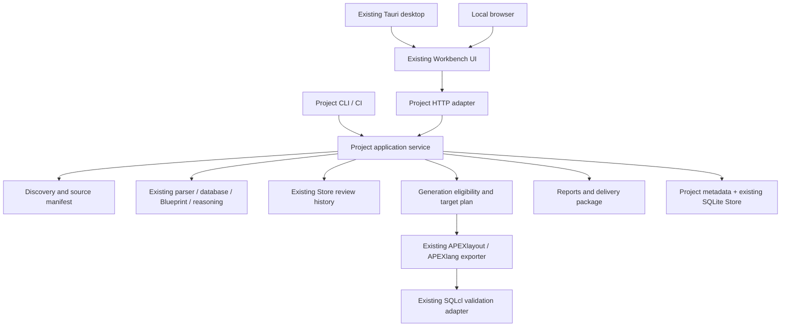

# FormsLang 2.0 product architecture

Status: architecture approved by the project owner on 2026-09-19;
implementation and release acceptance are not complete.

Date: 2026-09-19. Audited source: `d592998`, following release `v1.6.0` at
`7563431792e4f6e4d1360e32328be5cbec69e113`.

This document translates the 208-section FormsLang 2.0 product brief into
implementation boundaries and acceptance contracts. The brief is authoritative.
Historical design documents describe earlier work; their obsolete status notes
do not override current code or this product direction.

See the [current-state audit](formsLang-2-current-state-audit.md) for implementation
evidence, known integration gaps and the freshly executed 1.x test baseline.

## 1. Product vision and success

**FormsLang — Oracle Forms to APEX Modernization Workbench.**

Understand. Assess. Modernize. Generate reviewable APEXlang.

FormsLang helps teams understand, assess, prioritize, and modernize Oracle Forms
applications into reviewable Oracle APEX 26.1 applications using deterministic
analysis, human-reviewed architectural decisions, and APEXlang.

The north star is time to a good modernization decision. The primary experience
is New Project → Sources → Analyze → Overview → Priority Review → Generate →
Validate → Modernization Package. Static assessment needs no account, AI provider,
database credentials, Oracle installation when XML is available, or CLI setup.

Automate what is safe. Assist what is complex. Escalate what requires human
judgment. A classification is not proof of functional equivalence. Generated,
validated, imported, and runtime-tested remain different facts.

Product measurements are local event durations and counts: first useful summary,
first opened critical finding, first reviewed decision, plan export, first valid
APEXlang package, review throughput, and triage distribution. Time saved requires
a real comparison study; do not infer analyst hours avoided from these events.
Benchmark accuracy remains an engineering metric, not a landing-page concept.

## 2. Personas and journeys

| Persona | First useful answer | Main journey |
|---|---|---|
| Forms developer | Where does this trigger's behavior go? | Inventory → module → source/evidence → target decision |
| APEX developer | What can I generate and what remains undecided? | Generate → mapping/blockers → code review → validate |
| Architect | Where are business rules, shared APIs and architectural risks? | Overview → Priority Review → Blueprint → Plan |
| Consulting lead | What is the scope and review workload? | Overview → distributions → backlog → executive report |
| Application owner | Which risks and business decisions need ownership? | Executive report → unresolved decisions → evidence links |

First-time acceptance covers a technically competent Oracle developer who has
not seen internal docs. The ten-minute journey ends at the most important
finding. The one-hour journey includes inventory, dependencies, distributions,
strategy, and one saved decision on a representative source set. Scripted demo
timings do not prove human usability; record automated and human evidence apart.

## 3. Current architecture and selected approach

The existing application already has a stdlib Python engine, SQLite sessions,
Tauri 2 Windows shell, loopback HTTP server, self-contained HTML/JavaScript,
deterministic Blueprint, conversion review, APEXlang exporter, and SQLcl driver.
The gap is an application-level workflow binding these capabilities together.

Three approaches were considered:

| Approach | Benefit | Cost / reason for decision |
|---|---|---|
| Extend the existing engine with a project application service | Reuses analysis, review and export; same desktop/CLI/API behavior | Selected; requires explicit project and module identities |
| Add a wizard that chains current endpoints | Small initial UI diff | Rejected; UI would own orchestration, credentials and session switching |
| Build a new frontend/service/storage stack | Clean starting surface | Rejected; duplicates working code and creates migration/security drift |

Preserve Python >=3.10, stdlib-only runtime, the Tauri shell, offline assets,
existing visual tokens, adjustable panes and authentication overlay. No new
frontend framework, server platform, remote service, or required database driver.



## 4. Information architecture and Workbench

Landing: New Modernization Project, Explore Demo Project, Recent Projects, and
Open Existing Session. No provider setup is required or promoted as a blocker.
Legacy conversion remains accessible inside a module's review workspace.

Primary navigation is Overview, Inventory, Review, Blueprint, Generate, Reports,
Project Settings. Portfolio is a small recent-project summary, not a server.
Documentation, structural diff and visual preview become contextual module
actions; they retain existing functionality and shortcuts where unambiguous.

The four conceptual wizard steps are:

1. Project: name required; description and client/organization label optional.
   The client label grants no authorization and is unrelated to an auth tenant.
2. Sources: folder picker for Forms, optional database and supporting roots;
   immediate discovered inventory and parse-support warnings.
3. Target: defaults to Oracle APEX / 26.1 / APEXlang. Reference DB and AI setup
   are optional disclosures, with Skip as the default.
4. Analyze: show scope and local-only mode, then start one background operation.

Use the existing loopback folder browser for browser and desktop parity. A native
directory picker may be an enhancement, not the sole way to create a project.
Authenticated mode must not gain arbitrary host filesystem browsing: source
roots must be host-authorized or staged through authorized project intake.

Overview answers scope, difficulty and next action. Compact, clickable inventory,
risk, recommendation and intervention distributions lead to a persistent review
table. Warnings and Start Priority Review precede advanced metrics. Unknown risk
and unknown verdict are visible categories, never folded into LOW or AUTO.

Lists are server-paginated (default 50, maximum 200) with lazy detail. Search and
composable filters retain project-scoped navigation state. Do not send full code
or complete histories on every poll. Reuse draft retention, stale response guards,
keyboard resizing, focus restoration, contrast and reduced-motion behavior.

## 5. Project model and ownership

One project is an application/estate scope, not one trigger or one open module.
Use `ProjectService` as a thin facade over focused ingestion, assessment, review,
generation, reporting and persistence modules. The service receives an authorized
project context; it does not trust a browser-supplied organization or path.

Keep `projects.py` as the registry/path authorization boundary, extending it for
local project discovery without creating auth identities for local users.
Authenticated projects continue to use `AuthStore` organization ownership.
Local recent-project entries are locators, not a second analysis database.

Proposed project directory:

```text
<project>/
  .formslang/
    project.json
    project.session.db
    modules/<source-id>/<revision>.session.db
    cache/<parser-version>/<content-hash>/
    backups/
    snapshots/
  artifacts/<generation-id>/
  reports/<assessment-revision>/<review-revision>/
```

The JSON descriptor is a portable, allowlisted locator/configuration document:

```json
{
  "project_version": "formslang-project/1",
  "id": "opaque-project-id",
  "name": "Order Management Modernization",
  "description": "",
  "client_label": "",
  "source_roots": [
    {"id": "forms", "kind": "forms", "path": "../legacy/forms"},
    {"id": "database", "kind": "database", "path": "../legacy/database"}
  ],
  "target_platform": "Oracle APEX",
  "target_version": "26.1",
  "target_representation": "APEXlang",
  "store": "project.session.db",
  "analysis_revision": null,
  "engine_version": null
}
```

`store` resolves under `.formslang`; source roots may intentionally reference
external read-only directories. Their authority is established at intake, not by
accepting the descriptor as permission. Relative paths are preferred; external
absolute paths remain supported and require relinking on another machine.
No credentials, prompt bodies or source text belong in the descriptor.

SQLite is authoritative for analysis/review/artifact state; JSON mirrors the
current revision for portability. Commit SQLite first and replace JSON atomically;
opening reconciles a stale mirror. Never use JSON and SQLite as competing stores.

Extend `Store` additively for project metadata, source manifest, analysis runs,
module links, durable jobs, human annotations, target plan, artifact manifests,
validation results and local workflow events. Preserve existing task, proposal,
decision, Blueprint review, settings and key-confirmation semantics. Reuse module
sessions to avoid collisions in legacy task IDs and preserve existing exports.

## 6. Analysis result and revision contracts

`ProjectAssessment` is a versioned projection containing inventory, source
manifest, Blueprint graph/findings/evidence, risk and strategy distributions,
review projection, target plan and generation readiness. It wraps existing
analysis; it must not implement a second classifier.

Separate four revisions:

- Source revision: digest of sorted root-relative source IDs, raw SHA-256,
  selected representation, missing/failed entries and relevant intake options.
- Analysis revision: source revision plus parser, database, lexical, catalog,
  risk, modernization and Blueprint engine versions and analysis options.
- Review revision: monotonically increasing committed review/annotation sequence.
- Artifact revision: digest of analysis, applicable review and target-plan
  revisions, generator/target profile, configuration and emitted files.

The current Blueprint hash includes database filenames rather than a complete
database content manifest, and its engine version omits `modernization.VERSION`.
The project revision must cover both. Add tests for a package-body-only edit,
DDL-only edit and modernization-version-only change before relying on staleness.
Do not rewrite historical benchmark artifacts to introduce this contract.

Analysis content is deterministic. Real timestamps and measured durations belong
in run metadata. Reports reuse the persisted analysis timestamp so exporting the
same snapshot twice does not create clock-only differences.

## 7. Source ingestion and supported boundaries

Discovery inventories candidate files before deep parsing. A supported extension
is not proof of a supported construct. Each entry records type, size, digest,
parser, representation, status and remediation. Skip output directories and
version-control/build directories; avoid duplicate roots, recursion cycles and
unapproved symlink/junction escapes. Enforce existing size limits before reads.

| Input | Existing capability | 2.0 treatment |
|---|---|---|
| Forms2XML `.xml` containing FormModule | Structural and code parsing | Parse offline; malformed XML reports location and action |
| `.fmb` | User's Forms2XML tool adapter | Discover; use selected XML or explicitly orchestrate installed tool |
| `.mmb`, `.olb` | Tool adapter knows conversion naming; FormModule model does not prove semantic support | Inventory separately; only claim parsed semantics when representation is supported |
| `.pll` and library representations | Attached references; no general PLL parser | Inventory and disclose missing semantic context; never count as parsed Forms |
| `.sql`, `.pks`, `.pkb` | Tables, views, sequences, package specs/bodies | Reuse database parser with file-level error isolation |
| `.prc`, `.fnc`, `.trg`, `.vw` | Not part of existing recursive discovery | Discover; supported content may use existing parser; unsupported routines/triggers remain explicit |

Standalone routine support requires a generic parser extension and independent
tests; changing filename filters alone is not implementation. Database objects
with duplicate qualified identity must produce a conflict rather than last-file
wins. Cross-schema and overloaded resolution remain unresolved unless supported
by evidence; current database parsing strips some schema qualification.

For an FMB with a paired XML, choose available XML in the new project flow by
default for zero-config assessment, recording that freshness relative to the FMB
is unverified. Offer conversion to refresh it. Keep legacy `_collect` behavior
for existing CLI commands. Count one analyzed module, not both representations.

Missing Oracle tooling offers Select existing XML, Continue with available files,
and exact instructions derived from `oracle.py` and the user's installed tool.
Conversion runs on a temporary copy and never writes to source folders.

Source Coverage means parsed selected representations / discovered in-scope
candidates, with counts for unsupported, failed, excluded and missing. It does
not estimate undiscovered database or library coverage. Unresolved references
are a separate ratio with an explicit denominator; no invented 84% DB completeness.

## 8. Analysis pipeline, jobs and cancellation

`analyze_project(project, progress, cancellation)` coordinates discovery, Forms
parsing, database parsing, symbol/dependency construction, current reasoning,
Blueprint construction and assessment persistence. UI and CLI call this entry
point through the service. The UI does not schedule engine functions itself.

Publish inventory as soon as discovery completes. Report phase, processed/total,
warnings, errors and elapsed time. Do not invent per-edge progress for engine
passes that do not expose it; show phase-level work instead. Each failed source
has a relative path, stable error code, sanitized reason and next action.

Persist jobs as Queued, Running, Completed, Failed or Cancelled, with operation,
project, requested revision, counters, cancellation flag and structured outcome.
A completed job can produce an incomplete assessment. On process restart an
orphaned job becomes Failed with reason `PROCESS_INTERRUPTED`; no background
continuation is promised after the app closes.

Use a project-scoped in-process lock plus transactional SQLite lease to prevent
CLI and desktop from publishing competing analyses. A worker owns its connection;
do not share one unguarded connection across requests. Revision compare-and-swap
rejects stale publication. Crash recovery must distinguish a dead worker from a
live worker in another process; opening a store cannot cancel another process.

Cancellation is checked between files and engine phases. It preserves the last
committed assessment and decisions. Incomplete run inventory/diagnostics can be
inspected separately. Recheck source digests before publishing; changed-during-run
inputs mark the run incomplete instead of publishing a mixed revision as Current.

## 9. Incremental refresh and persistence

Opening uses the saved assessment immediately; a lightweight freshness check
updates Current / Stale / Incomplete with last-checked time. Missing roots allow
inspection of saved evidence and a Relink action, never silent fresh generation.

P0 uses complete content manifests and safe full analysis. P1 caches parsed
modules/database files by raw content hash and parser version; reusing parsing
does not imply cross-layer reasoning can be skipped. Initially rebuild the graph
and recommendations conservatively. Optimize affected subgraphs only after tests
prove changes propagate to dependents and unresolved references.

A stale source, engine or relevant target decision invalidates generation and
review applicability, not history. Start with conservative project-wide revision
binding; dependency-scoped invalidation is a later optimization. No stale approval
is copied to changed source just because its normalized fingerprint looks alike.

## 10. Assessment, priority and readiness

Inventory counts entities by real type; package spec/body counts are distinguished
from unique package count. A modernization unit is an engine finding, not every
graph node. Business-rule candidate counts are a separate population. Every
distribution names its scope and denominator to prevent double counting.

Retain risk, recommendation and intervention as separate dimensions. AUTO means
mechanical classification, not generation authorization. Unknown, DROP and legacy
WRAP_AS_API remain representable, even if uncommon. Strategy/automation charts
state: based on decision categories, not project-duration estimation.

Priority is a transparent ordered tuple, not a probability:

1. Unresolved critical safety findings.
2. Other unresolved findings by risk (unknown risk is investigation, never LOW).
3. Manual decision requirement, then stale decision requirement.
4. API bypass, duplicated business logic and cross-module impact when evidenced.
5. Number of distinct incoming dependent units, then stable source identity.

Expose factors and allow a reviewer to change sorting. Resolved items remain
searchable. No PageRank or AI weighting is required for P0.

Prefer factual ratios over a new composite readiness score:

- Assessment: analyzed selected sources / in-scope candidates, plus completion state.
- Review: current Accepted or Changed decisions / findings, with critical and manual
  subsets separately. Deferred, Needs Review and stale decisions are unresolved.
- Generation: eligible target units / planned target units, always beside blockers.
- Validation: validated artifact hashes / generated artifact hashes.

An empty denominator displays Not assessed / No planned scope, not 100%.
Keep legacy `readiness/1` available as Migration work progress; never relabel it
as 2.0 generation readiness or reuse its number in a portfolio without its formula.
New product reports omit assumed labor hours and costs. Legacy estimation flags
remain explicit compatibility tools with their assumptions documented.

## 11. Review workflow and evidence

Use existing append-only Blueprint reviews and immutable finding snapshots.
UI states map as follows:

| UI | Existing action/state | Effect |
|---|---|---|
| Pending | PENDING | No applicable decision |
| Accepted | APPROVE | Accept architecture recommendation |
| Changed | MODIFY | Save separate human target/recommendation |
| Needs Review | REJECT | Recommendation not accepted; remains unresolved |
| Deferred | DEFER | Deliberately postponed |
| Needs Revalidation | STALE | History retained; previous decision no longer applies |

Store actor, timestamp, previous decision ID, engine recommendation/version,
source/analysis revision and target, alongside rationale and coverage evidence.
The current engine recommendation is never overwritten by the human overlay.
Default local reviewer is the OS identity, visibly labeled; authenticated reviewer
comes from the current server session, never from submitted display text.

Existing review rationale is required. Reduce friction with an explicit accepted
rationale for unchanged low-risk decisions; optional free-text notes remain
optional. Changes to high/critical decisions require a reason; critical overrides
also require explicit confirmation bound to that finding revision. The confirmation
does not turn missing code, unresolved dependencies or failed validation into success.

Decision detail answers what, why, recommendation, evidence and next step in the
first screen. Reuse adjustable source/proposal panes and show related database
evidence alongside Forms. Detail includes body-relative locations, incoming and
outgoing links, risk factors, target suggestions and unresolved questions. Raw JSON
and reason codes live in advanced disclosure. Facts, inference and human statements
must remain distinguishable.

Human annotations record business-rule confirmation, presentation-only behavior,
authoritative API, obsolescence and need for business-owner input. They have their
own revision/history and never mutate source analysis. A confirmation informs
planning and eligibility but is not executable code approval.

Bulk preview selects exact IDs/revisions and shows counts/exclusions. Low-risk
mechanical acceptance is allowed only by a server-side eligibility rule; generic
AUTO is insufficient. Critical/manual/security/identity/workflow-sensitive items
require a second explicit, revision-bound confirmation with rationale and remain
subject to generation gates. No endpoint bypasses policy by omitting the UI.

## 12. Blueprint, rules and target architecture

Reuse the existing graph with focus node, first-degree neighbors, expand on
demand, relation filters and bounded results. Expose callers, callees, touched
tables, dependent Forms and duplication edges; never infer execution order from
static graph arrows. Module assessment links the same findings, not copies.

Business Rules lists static candidates and human confirmations separately.
Centralized/duplicated/Forms-only groupings require concrete evidence; ambiguous
or missing database context goes to Requires Review. Absence of a candidate does
not prove absence of a business rule.

Target plan groups work into database prerequisites, shared APIs, APEX shared
components, pages, security, navigation, manual decisions, validation and testing.
Each element references evidence or a human decision and has status Proposed,
Reviewed, Blocked, Generated or Validated. Page IDs are persisted allocations;
reordering sources must not renumber pages and break references.

P0 default starts with the existing one-module/one-page mapping, explicitly
reviewable. Splits and modal/navigation redesign remain decisions, not invented
page counts. Recommendations may exceed implemented generator capability; show
that distinction. For CALL_FORM, offer only supported design choices and Keep
unresolved / Needs business-owner decision. A recommendation alone never wires
a dynamic action, grants authorization or changes transaction ownership.

## 13. APEX 26.1 and generation boundary

A target profile owns platform `Oracle APEX`, version `26.1`, representation
`APEXlang`, template/MMD version, mapping capabilities and validation adapter.
Only implemented profiles are selectable. Replace scattered new version literals
with this profile; preserve tested 1.x template behavior.

Generation modes:

- Selected module: reviewed mapping and eligible code, with explicit exclusions.
- Reviewed pages: selected target-plan pages from one application.
- Project skeleton: explicitly approved structural scope; no unreviewed business
  code or implicit DML. Label as a skeleton with unresolved work.
- Approved modernization package: eligible generated scope plus reports, evidence,
  decisions, prerequisites and backlog. Ineligible parts remain listed.

Reuse `apexlayout` and `apexlang` to extend assembly for multiple reviewed modules
under one application/template. Do not concatenate separately exported apps or
silently duplicate shared components. Allocate page, item, component and shared
LOV names deterministically; detect collisions and require a resolution.

Generation eligibility is evaluated in Python for GUI, CLI and API. It binds
requested scope to the current source, analysis, reviews and target-plan revision.
Blockers include unsupported target profile, stale/missing source, unresolved
critical/manual architecture, unsupported mapping, missing code approval, binding
key not confirmed, and unresolved required database/security prerequisites.

Architecture approval does not approve PL/SQL. Reuse existing conversion review
for edited/AI-authored code. Deterministic native mappings require an implemented,
tested mapper plus reviewed scope. Preserve the exporter rule that unapproved
code cannot execute. Confirmed row keys are still a separate human assertion.

Partial generation omits or disables affected behavior and lists exactly what was
excluded. If omission would create an unsafe usable page (for example a save
action without approval enforcement), block that page rather than emit it as ready.
An independent safe page may still generate. Unknown is never a fallback approval.

Freeze an immutable generation input and recheck revision before commit. Write to
a new artifact directory and publish atomically, preserving earlier packages and
manual edits. Regeneration creates another artifact; it does not overwrite a
human-edited `.apx` tree. Record file hashes and expose structural preview from the
same layout model. No simulated runtime screenshots.

Database outputs contain reviewed proposed changes only where a supported generator
exists. Otherwise provide refactoring candidates, prerequisites and rationale,
clearly non-executable. Never create dummy successful SQL or duplicate all database
source. Nothing executes DDL or deploys automatically.

## 14. Validation and optional database verification

Reuse `apeximport.run_import(..., validate_only=True)` for offline SQLcl validation,
including its compile-error-marker detection. Persist artifact hash, tool version,
mode, outcome, timestamp and sanitized diagnostics. Missing SQLcl is Not Validated
with configuration guidance, not Validation Failed or Validated.

UI distinguishes Generated, Not Validated, Validated and Validation Failed, with
validation scope shown. Editing an artifact changes its hash and invalidates the
old validation claim. Compilation does not establish runtime parity.

Import remains a separate explicit action with target workspace/schema/application
review and overwrite warning. No generation or validation action invokes import.
Runtime acceptance uses an authorized disposable target and preserves current
authentication; it never makes a page public to simplify a check.

Optional Validate Database Assumptions uses fixed, read-only queries through the
existing SQLcl boundary, with credentials from the existing OS vault. It reports
version, visible object existence/validity and supported dependency metadata.
Visibility denied is Unknown, not absent. Live observations have timestamps and
provenance and are separate from deterministic source evidence. Arbitrary SQL,
dynamic generated identifiers and automatic CREATE/ALTER/DROP are outside this action.

## 15. Reports, backlog and modernization package

Reports read persisted assessment/review projections without reanalysis. All report
content is escaped; executive HTML is self-contained, printable and script-free.
It excludes code bodies, source excerpts, absolute paths and raw reviewer notes.
Technical detail is an explicit export scope; full evidence may contain sensitive
source and is labeled accordingly. Do not promise that regex redaction makes
technical exports safe for public distribution.

Executive sections: summary, scope/inventory, assessment and generation readiness,
risk, automation categories, critical findings, architecture, unresolved human
decisions, next steps, methodology/limitations.

Technical sections: source/database inventory, Forms structure, dependencies and
cross-layer calls, business-rule candidates, duplication/API ownership, strategy,
risk/module breakdown, review queue, target mapping, prerequisites, generation
readiness and limitations. Risk report is a focused view of the same findings.

Backlog CSV/JSON includes stable ID, application, module, component/source type,
recommendation, risk, intervention, review status, target, reason, dependencies,
optional owner and notes. Neutralize spreadsheet formula injection in CSV cells;
preserve exact machine values in JSON. No effort fields without calibrated data.

```text
modernization-package/
  README.md
  manifest.json
  assessment/{executive-summary.html,technical-assessment.html,risk-report.html,
              application-inventory.json}
  architecture/{target-architecture.md,dependency-map.json,modernization-decisions.json}
  apexlang/<application>/application.apx
  apexlang/<application>/pages/*.apx
  apexlang/<application>/shared-components/
  apexlang/<application>.apex.zip
  database/{prerequisites.md,refactoring-candidates.md}
  database/proposed-api-changes.sql  # only when reviewed changes exist
  backlog/{modernization-backlog.csv,modernization-backlog.json}
  review/{decisions.json,unresolved-decisions.csv}
  evidence/analysis.json            # explicit full-evidence export scope
```

Manifest records scope, versions, source fingerprint, assessment timestamp,
analysis/review/target revisions, exclusions, per-file digests and validation
evidence. Omitted generation/evidence directories are explicitly listed. Delivery
ZIP and deployable APEX ZIP remain distinct; reports and review history never
accidentally become deployable app content.

P1 assessment snapshots freeze manifest, analysis, review sequence and reports.
Export uses a consistent read transaction; ongoing reviews cannot mix snapshots.
Snapshots are never mutated or treated as current after the source changes.

## 16. Security, privacy and authorization

Keep local mode account-free and loopback-only. In auth mode, revalidate session,
MFA scope, membership, organization and action for every project request, job read,
evidence detail, report and artifact. Reuse RBAC/export grants and return the same
404 for absent and foreign projects. No P0 remote/team-server exposure.

Source intake is an explicit host capability. In authenticated mode, selection is
limited to host-approved roots or authorized staged uploads; project JSON is not
a filesystem capability. Resolve and recheck containment for paths, junctions,
symlinks and artifact downloads. Never follow user-authored export paths into
another project. Logs use error codes and counts, not code or credentials.

Preserve Host, content-type, session/CSRF controls and resource limits. New browser
mutations enforce exact Origin including port; local non-browser calls use the
documented local API policy. Harden IPv6 parsing with an actual URL/host parser.
Loopback HTTP cookies retain HttpOnly/SameSite; do not claim HTTPS Secure-cookie
transport or trust proxy headers while server mode is unimplemented.

Passwords, AI keys and MFA secrets remain in the OS credential store or ephemeral
environment/input, never descriptor, SQLite, reports, temp scripts or command
arguments. No plaintext fallback. Diagnostics default to version/platform,
allowlisted configuration, counts and sanitized errors with paths/code removed.

AI is optional and off by default for project operations. Reuse Blueprint's
bounded anonymized explanation context. Display provider, effective egress and
data scope before explicit requests. Legacy conversion sends code when explicitly
invoked; this larger scope must be disclosed distinctly. No AI response can
alter deterministic risk, reviews, eligibility or target plan automatically.
Private-address egress classification is not proof a proxy keeps data private.

Local event instrumentation records timestamps, counts and operation categories.
No external telemetry. A compromised OS account is outside application isolation.

## 17. CLI, API and compatibility

Add `formslang project` subcommands for create, discover, analyze, status, review,
report, generate, validate and snapshot as their phases ship. Existing assess,
inspect, catalog, doc, diff, preview, convert, workbench, export, apex and auth
commands remain. Use 0 for success, 1 for partial/operation failure and 2 for
invalid invocation/configuration, matching existing conventions.

Add `/api/v2/projects` endpoints instead of changing the meaning of legacy
`/api/projects`, which is an authenticated registry today. New routes operate on
opaque project IDs and include summary, inventory, review list/detail, analysis
jobs, review mutation, plan, generation eligibility, artifacts, validation and
reports. Browser code receives prepared projections, not raw engine functions.

Mutations carry analysis/review revision preconditions. Stale requests return
409 with reload/remediation guidance. Async starts return 202 and a persisted job
ID. Paginated reads include total, limit and revision so clients cannot silently
combine rows from different assessments. Cache summaries by project, analysis,
review and target-plan revisions; invalidate after external SQLite commits too.

Legacy module APIs continue to use their session contract. Explicitly bridge a
project's module session to the existing code editor; switching tabs or projects
cannot route delayed writes to another session. Authenticated legacy routes must
receive the same project ownership check wherever they access a project session.

## 18. Migration from 1.x

Do not modify original user sessions on first discovery. Offer Open existing
session and Add to modernization project. Import uses SQLite backup API into a
staged project copy, validates known FormsLang schema and integrity, applies
additive migrations transactionally, verifies preservation and atomically publishes.
Record original path/digest and migration version. Do not silently adopt an
unrelated SQLite file or deduplicate solely by basename/module name.

Preserve tasks, proposals, all decisions/history, Blueprint reviews/snapshots,
settings, key confirmations, test specifications/results and export checksum salt.
Legacy sessions with no source remain inspectable and exportable under the legacy
contract; new project analysis/generation explains missing source requirements.
Stale architectural reviews remain history rather than being falsely reapproved.

Keep existing config locations and vault account names. Recent-project indexing
is additive. AuthStore remains lazy in local mode. Adopted organizations retain
IDs, roles, grants and paths; migration must not expose them to local mode.
Use backups before schema migration and fail without changing originals.

Installer tests explicitly upgrade 1.6.0 to the eventual 2.0.0 candidate on NSIS
and MSI. Seed conversion and Blueprint decisions, project registry and settings;
verify reopen, permissions, export determinism and metadata preservation. A legacy
module approval alone is insufficient 2.0 upgrade acceptance.

## 19. Performance and observability

Measure cold/warm 100- and 500-Form synthetic estates with varied module bodies,
shared dependencies, same-name modules, malformed inputs and missing libraries.
Record hardware, OS, Python, commit, fixture seed/digest, file/byte/finding counts,
discovery/first-summary/total duration, parsed cache hits, process peak memory,
project reopen and search/filter latency, and browser interaction responsiveness.

Use `perf_counter`/existing telemetry; process memory can be measured by the
external Windows harness and POSIX resource tooling. Python allocation peak is
not process RSS and must be labeled separately. Measure baseline before setting
regression thresholds; publish measured results only. No arbitrary numeric budgets
or replicated-demo timings presented as customer-estate performance.

First optimize bounded API payloads, cached summaries and lazy detail. If scale
evidence requires it, add indexed projection tables/search. Do not promise fuzzy
semantic search before an implementation exists; normalized exact/substr search
is the first reliable global search contract.

## 20. Delivery phases and acceptance

| Phase | Deliverable | Acceptance before proceeding |
|---|---|---|
| A — architecture/model | Audited baseline, project descriptor/revisions, additive persistence/service boundary and migration | Same-name modules; path isolation; legacy state preservation; DB-only staleness |
| B — onboarding/orchestration | Four-step UI, discovery, progress/cancel, one-call static analysis | No credentials/provider; partial failure; reopen; interrupted-run integrity |
| C — overview/inventory | Real distributions, warnings, source coverage, bounded lists and priority links | Counts reconcile with persisted findings; unknowns visible; keyboard access |
| D — review | Priority queue, source/DB evidence, history, overrides and annotations | Context isolation; stale rejection; critical confirmation; review/code separation |
| E — APEXlang | Target profile/plan, partial-scope gates, multi-page assembly, preview and validation | Unsafe pages blocked; stable names; repeated bytes; SQLcl positive/negative controls |
| F — delivery | Executive/technical reports, backlog and modernization package | No source in executive export; escaped HTML/CSV; reproducible snapshot provenance |
| G — quality | Synthetic product fixture, browser/CLI E2E, scale, migration, accessibility and five-persona review | Full suite and security gates; real screenshots; measured limitations |
| H — release | Version bump, release commit/tag, CI installers and upgrade acceptance, published assets | Exact tested binaries/digests; no failing jobs; honest acceptance record |

P0 includes every must-ship item in brief §188. P1 (incremental parsing, richer
module assessment/search, safe bulk, portfolio summary, snapshots and advanced
readiness) follows only where P0 remains sound. P2 connectors, central server,
marketplace and advanced collaboration are deferred. Optional live DB verification
does not make credentials necessary for P0.

Each implementation phase gets a concrete plan, focused tests and a coherent
commit. Do not bump versions during architecture work. Do not mark the 40-item
final delivery report complete while any P0 acceptance remains unverified.

## 21. Test and release strategy

Reuse the current test pyramid: pure engine tests, Store/service integration,
loopback HTTP/auth tests, Node-based JS behavior checks, Edge/Chromium acceptance,
deterministic export, SQLcl validation with negative controls, and Windows installer
upgrade. A separate desktop frontend test framework is unnecessary: Tauri serves
the same tested HTML; native shell behavior is verified in installer acceptance.

Add a compact synthetic product fixture with multiple Forms, shared APIs,
duplication, navigation, native mapping and critical manual review. Bundle a small
demo subset as package data and verify it exists in the frozen engine. Do not
reuse benchmark IDs or hand-tune reasoning to the demo. Existing frozen v1/v2/v3
baselines and ground truth stay immutable; hash them before and after work.

Corporate acceptance: create → select Forms/database → analyze → inspect overview
and critical evidence → accept one decision/change another → generate eligible
scope and package → SQLcl validate → export report → close/reopen → verify history.
Run CLI equivalents against the same project model. Include negative cases for
stale source, unsupported library, missing SQLcl, malformed module, malicious HTML,
CSV injection, symlink escape, cross-tenant IDs, revoked membership and revision races.

Five-persona review checks traceable business logic, real APEX-native targets,
consulting deliverables, confidential-source boundaries and unaided onboarding.
Agent inspections are not represented as human research participation.

Follow `docs/releasing.md`: after product gates, set all seven version files to
2.0.0, regenerate package metadata/locks, rerun required tests, commit and create
an annotated tag. Run CI and Installer acceptance against that exact candidate,
explicitly naming baseline 1.6.0. If a release gate fails, do not publish; fix and
produce a new reviewed release candidate without silently moving published tags.
Publish only acceptance artifact installers and compare published SHA-256 values.

Connected Oracle/APEX acceptance uses authorized disposable schema/application.
Record actual commands/results separately from offline validation. No customer
environment, source or screenshots are required or allowed in public evidence.

## 22. Documentation and future direction

During implementation produce `docs/architecture-2.md`, `docs/project-model.md`,
`docs/product-workflows.md`, `docs/apex-26-modernization.md`, `docs/forms-to-apex.md`
and testing/migration/security guidance. Rewrite README with the actual implemented
workflow, Windows quick start and real Overview/Review/Generate screenshots.
Keep CLI quick start and limitations accessible. Resolve obsolete methodology,
SPEC and authentication status claims rather than layering contradictory promises.

Release notes lead with onboarding, assessment, review, APEXlang and deliverables.
No Oracle endorsement or arbitrary-production-conversion claims. Disclose library,
dynamic SQL, business-intent, mapping, runtime/UAT and local-server limitations.

After 2.0, prioritize portfolio/team workflow on proven project boundaries, deeper
library ingestion, real analyst-productivity/estimation research and company policy
packs. No dates or fabricated ROI. Each addition must shorten assessment, reduce
review effort, improve decisions, improve trust or improve delivery.

## 23. Brief traceability

| Brief sections | Architecture sections / delivery phases |
|---|---|
| 1–8 | 1–5, 20; audit and Phase A |
| 9–22 | 4–8; Phase B |
| 23–30 | 10; Phase C |
| 31–42 | 11; Phase D (bulk P1) |
| 43–46 | 12; Phases C/D |
| 47–53 | 13–15; Phases E/F |
| 54–57 | 15; Phase F |
| 58–59 | 5–9; Phase A/B, incremental P1 |
| 60–66 | 16; all phases |
| 67–80 | 4, 11–12, 21; Phases B–G |
| 81–94 | 9–10, 16, 19, 22; core performance G, portfolio P1, extensions P2 |
| 95–100 | 5, 17–18; Phases A/B/G |
| 101–118 | 4, 6, 11, 15, 20–21; Phases D/F/G/H |
| 119–126 | 8–10, 15, 19–21; Phases F/G |
| 127–138 | 18, 21–22; Phases G/H |
| 139–160 | 7, 11–14, 19–21; Phases D/E/G |
| 161–177 | 3, 5–9, 15–17, 21–22; Phases A–G |
| 178–198 | 1, 19–22; Phases G/H |
| 199–208 | 2, 20–22; final acceptance and post-2.0 roadmap |

## 24. Design review checklist

- One analysis engine and one project domain across interfaces: specified.
- No account/provider/database prerequisite for static assessment: specified.
- Authenticated path authority and legacy route compatibility: specified separately.
- Architecture approval, code approval, generation and runtime evidence: distinct.
- Unknown/partial/stale/failed states: explicit, never mapped to success.
- Migration preserves originals and full history: required with tests.
- Product scope and release gates: P0 before optional expansion.
- Benchmark history and customer confidentiality: immutable/public-safe boundaries.
- Implementation status: design approved; no feature or release claim is made by this document.
