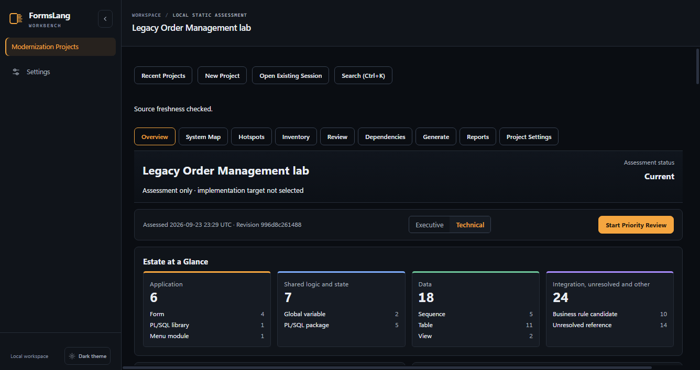
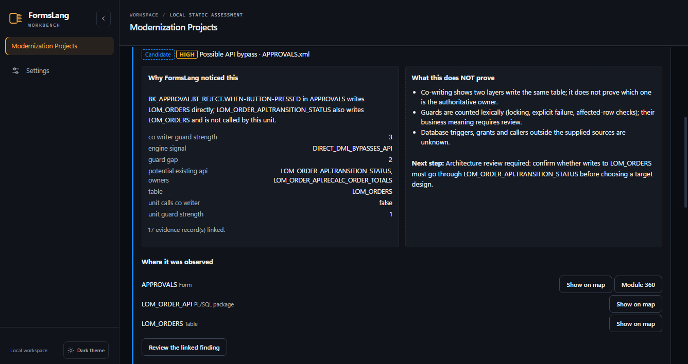
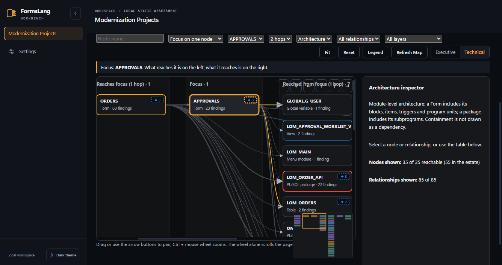
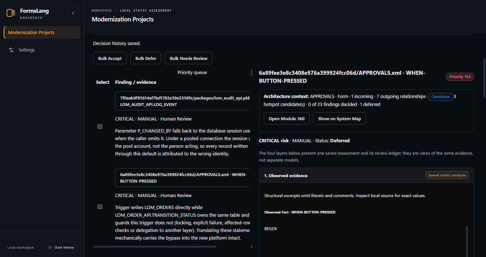
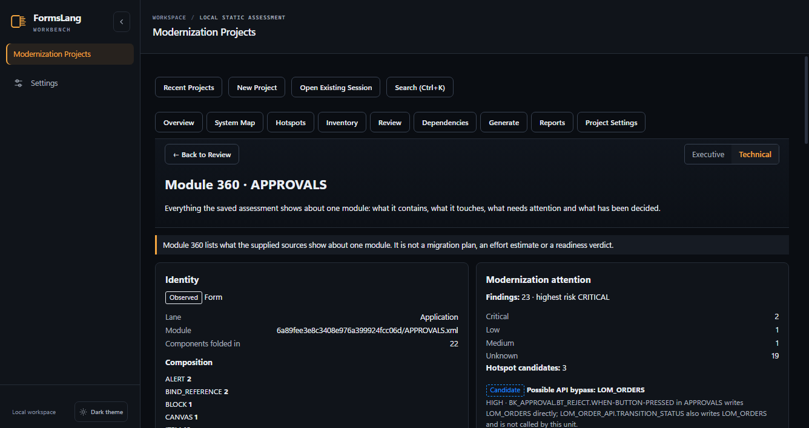

# Modernization lab walkthrough

The [Legacy Order Management lab](../examples/modernization-lab/README.md) is
a fictional Oracle Forms application with four Forms modules, a PL/SQL API
layer and a schema. This walkthrough follows it through the Workbench, from
the estate to a recorded human decision and the reports, without using the CLI.

Every screen below comes from the browser acceptance run
(`examples/verify/project_showcase_browser_check.mjs`, called by
`examples/verify/project_browser_check.py`). That run creates the project in
the UI, lets the engine analyse the lab and checks each step against the
saved product state. None of the numbers or relationships shown here are
entered by hand.

## Sources

- **Forms:** `examples/modernization-lab/forms/xml` (APPROVALS, CUSTOMERS,
  INVENTORY, ORDERS as Forms2XML).
- **Database:** `examples/modernization-lab/database` without `seed/`.

The seed scripts insert sample rows into a live database. They are not schema
source, and the engine reports them as unsupported SQL. With `seed/` included,
the assessment is correctly marked **Incomplete**, and Review refuses to record
decisions until the input is fixed. Leave `seed/` out when you follow this
walkthrough.

The project is created with **Analyze my Forms estate**, so no implementation
target is selected (assessment only).

## 1. Estate and source coverage

The Overview reports 4 Forms modules, 5 PL/SQL packages, 11 tables, 2 views
and 6 hotspot candidates: 2 possible API bypasses, 3 duplicated business-rule
candidates and 1 global-state coupling. **Estate at a Glance** groups the
estate by architectural lane. Source Coverage shows what was analysed.
**Start Here** lists what to review first and explains the order on each line
("Why: …").

## 2. An API bypass candidate

In the Hotspot Explorer, the type filter narrows the list to the two
**Possible API bypass: LOM_ORDERS** candidates. The engine found that
`BK_APPROVAL.BT_APPROVE` and `BT_REJECT` in APPROVALS write `LOM_ORDERS`
directly, and that `LOM_ORDER_API.TRANSITION_STATUS` also writes that table
without being called by those units.

Each card shows the signals behind the candidate under **Why FormsLang noticed
this** and the limits of the evidence under **What this does NOT prove**. For
example, co-writing does not show which layer is the authoritative owner.

## 3. Form, package and table on the System Map

**Show on map** opens the System Map focused on APPROVALS. The acceptance run
checks two highlighted relationships:

- APPROVALS WRITES LOM_ORDERS;
- LOM_ORDER_API WRITES LOM_ORDERS.

What reaches the focus is drawn on the left and what it reaches is on the
right. **Back** returns to the filtered Hotspot Explorer.

## 4. Review: FormsLang proposes, a human decides

**Review the linked finding** opens the trigger in Review. The detail keeps
four things apart: observed evidence, structural interpretation, the engine's
PROPOSED recommendation and the human decision. The architecture context at
the top shows where the module sits.

In this walkthrough the reviewer defers the finding, with the note "confirm
whether LOM_ORDER_API must own every LOM_ORDERS write". The decision goes into
the append-only review ledger. The context then reads "0 of 23 findings
decided · 1 deferred", because a deferred finding is not a decided one.

## 5. Back to the architecture

**Open Module 360** shows APPROVALS as a whole: its composition, neighbours,
hotspot candidates, findings and review state. The deferred decision is
already counted there. Module 360 is a view of the saved evidence. It is not a
migration plan, an effort estimate or a readiness verdict.

## 6. Deliver

The executive and technical reports are produced from the same saved
snapshot. Each report carries two static SVG figures:

- the estate by lane;
- the modules × hotspot-type matrix, with the same candidates.

The figures contain no script, link or `foreignObject`. See
[Reports and delivery](user-guide/10-reports-and-delivery.md).

## What this walkthrough does not show

- Runtime behaviour of the Forms application or of any generated target.
- Which layer owns `LOM_ORDERS`. The engine flags the co-writing; the
  architecture decision stays with a person.
- Health scores, migration percentages, effort, schedule or waves. FormsLang
  does not produce them.
