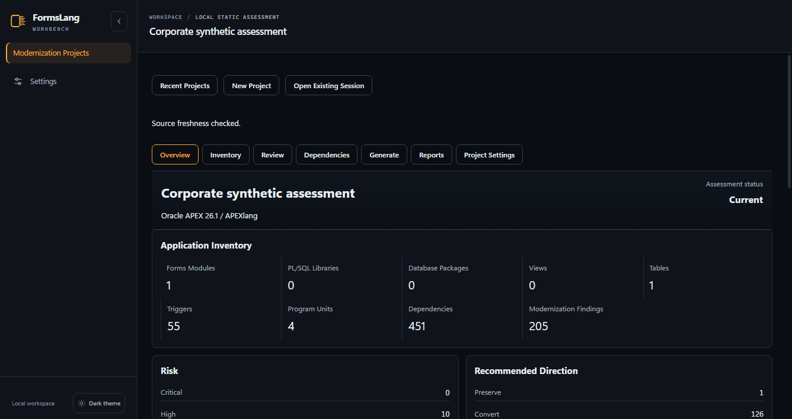
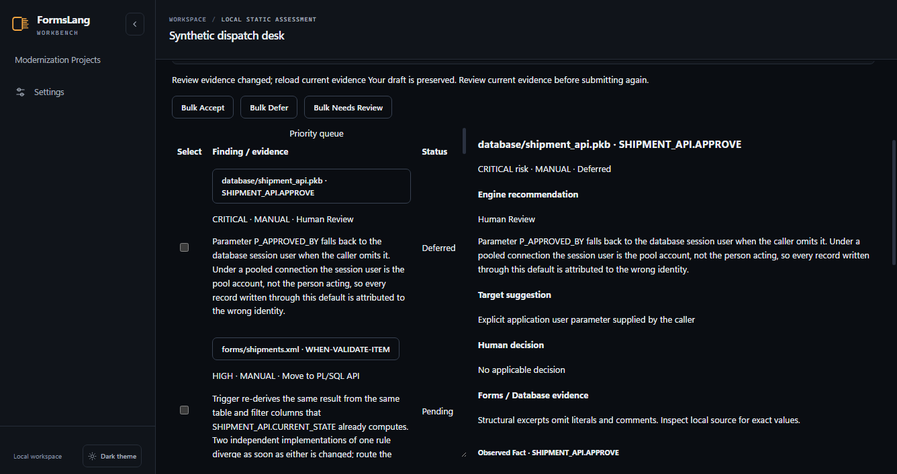
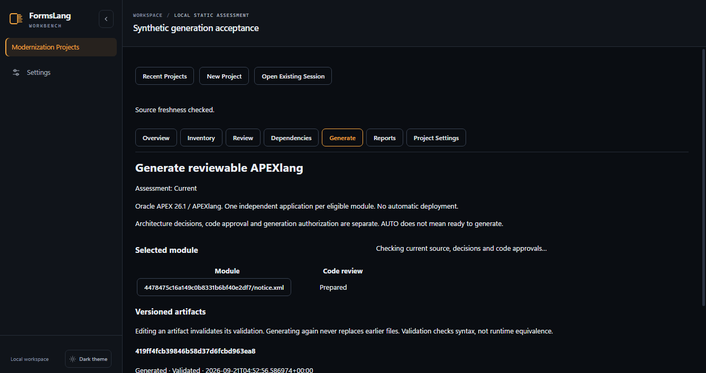
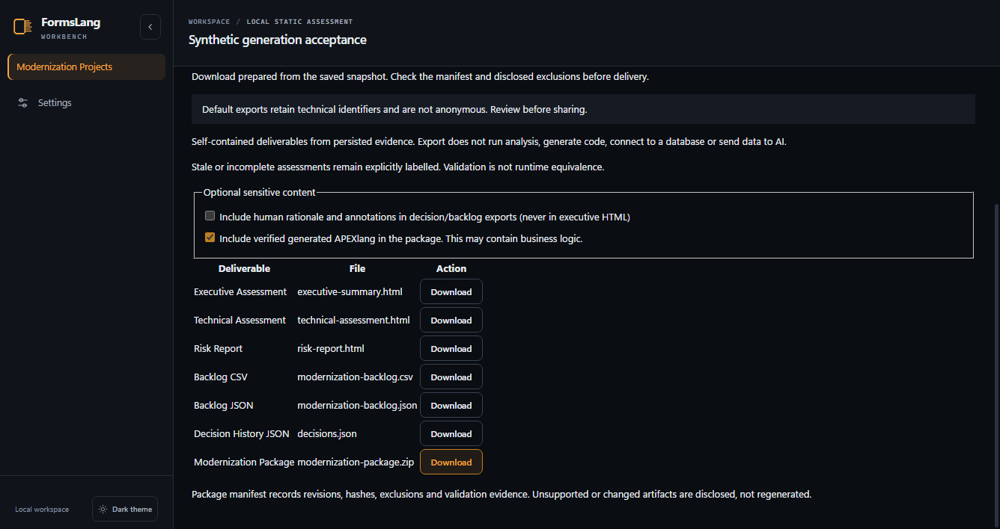

# FormsLang corporate user guide

This guide describes the FormsLang 2.x project workflow, including the 2.2 visual views. Release/installer evidence is recorded in [quality acceptance](../quality-acceptance.md).

1. [Getting started](01-getting-started.md)
2. [Installation](02-installation.md)
3. [Projects](03-projects.md)
4. [Source discovery](04-source-discovery.md)
5. [Analysis](05-analysis.md)
6. [Overview and Inventory](06-overview-and-inventory.md)
7. [Modernization Review](07-modernization-review.md)
8. [APEXlang generation](08-apexlang-generation.md)
9. [Validation](09-validation.md)
10. [Reports and delivery](10-reports-and-delivery.md)
11. [CLI](11-cli.md)
12. [Security and privacy](12-security-and-privacy.md)
13. [Enterprise usage](13-enterprise-usage.md)
14. [Troubleshooting](14-troubleshooting.md)
15. [Limitations](15-limitations.md)

Automate what is safe. Assist what is complex. Escalate what requires human judgment.

## Real candidate screens

Synthetic fixtures, captured through the real browser/API/Store acceptance path:

The Review capture deliberately shows the concurrent-client safety test, not a
successful approval. These captures do not demonstrate runtime Forms/APEX parity.

The [modernization lab walkthrough](../modernization-lab-walkthrough.md) follows the
fictional Legacy Order Management lab from the estate to a recorded human decision
and the reports, through the same browser acceptance path.
